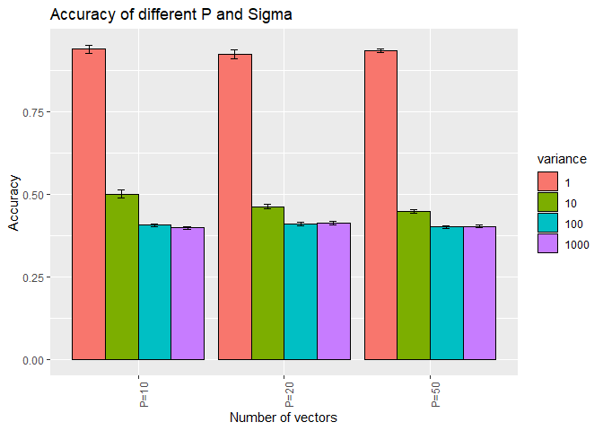
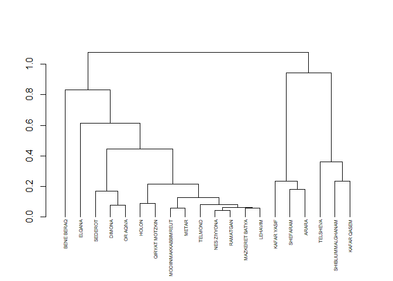
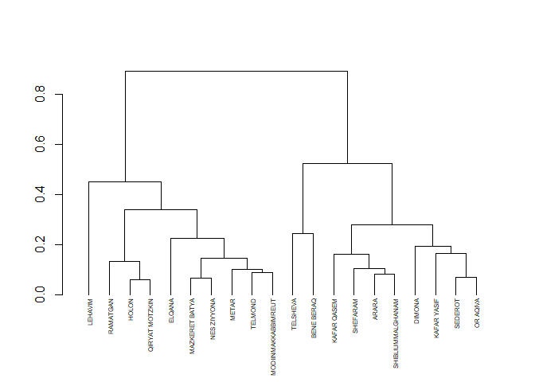
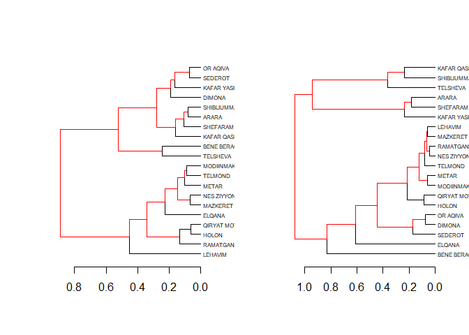
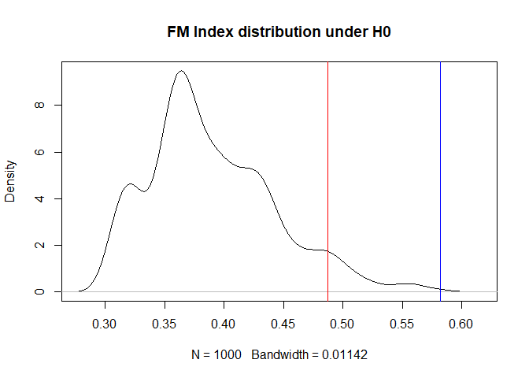

**Question 1**


```r
library(tidyverse)
```

```
## -- Attaching packages --------------------------------------- tidyverse 1.3.1 --
```

```
## v ggplot2 3.3.3     v purrr   0.3.4
## v tibble  3.1.2     v dplyr   1.0.6
## v tidyr   1.1.3     v stringr 1.4.0
## v readr   1.4.0     v forcats 0.5.1
```

```
## -- Conflicts ------------------------------------------ tidyverse_conflicts() --
## x dplyr::filter() masks stats::filter()
## x dplyr::lag()    masks stats::lag()
```

```r
library(dplyr)
library(ggplot2)
library(mvtnorm)
library(dendextend)
```

```
## 
## ---------------------
## Welcome to dendextend version 1.15.1
## Type citation('dendextend') for how to cite the package.
## 
## Type browseVignettes(package = 'dendextend') for the package vignette.
## The github page is: https://github.com/talgalili/dendextend/
## 
## Suggestions and bug-reports can be submitted at: https://github.com/talgalili/dendextend/issues
## Or contact: <tal.galili@gmail.com>
## 
## 	To suppress this message use:  suppressPackageStartupMessages(library(dendextend))
## ---------------------
```

```
## 
## Attaching package: 'dendextend'
```

```
## The following object is masked from 'package:stats':
## 
##     cutree
```

```r
library(plotly)
```

```
## 
## Attaching package: 'plotly'
```

```
## The following object is masked from 'package:ggplot2':
## 
##     last_plot
```

```
## The following object is masked from 'package:stats':
## 
##     filter
```

```
## The following object is masked from 'package:graphics':
## 
##     layout
```

```r
library(tictoc)
```

1) Generate the first 10 coordinates of each µj vector j = 1, .., 3.


```r
set.seed(500)
mu1 <- rnorm(10,0,1)
mu2 <- rnorm(10,0,1)
mu3 <- rnorm(10,0,1)
mus <-list(mu1,mu2,mu3)
```

2) Write a function that outputs a simulated dataset of dimension 100×p given (a) the first 10 coordinates of each µj , (b) p, and (c) σ^2


```r
norm_simo <- function(mus,p,sig){
vectors1 <- rmvnorm(20,mean=c(mus[[1]],rep(0,p-length(mus[[1]]))),sigma =diag(sig,p))
vectors2 <- rmvnorm(30,mean=c(mus[[2]],rep(0,p-length(mus[[2]]))),sigma =diag(sig,p))
vectors3 <- rmvnorm(50,mean=c(mus[[3]],rep(0,p-length(mus[[3]]))),sigma =diag(sig,p))
dat <- rbind(vectors1,vectors2,vectors3)
return(as.data.frame(dat))
}
```

3) Choose 4 levels of σ and use p = 10, 20, 50.


```r
sig <- c(1,10,100,1000)
p <- c(10,20,50)
```
4) For each combination of σ  and p, generate multiple datasets (say B = 50)
5) For each data-set, run K-means once on the p dimensional data, and save accuracy and run-time


```r
accuracy<-c()
run_time <-c()
for (i in 1:length(sig)) {
  for (j in 1:length(p)) {
    for (k in 1:50) {
      dd <- norm_simo(mus=mus,p[j],sig[i])
      dd_r <-dd
      dd_r$real <- c(rep(1,20),rep(2,30),rep(3,50))
      start_time <- Sys.time()
      kmean_dd <-kmeans(dd,3)
      end_time <- Sys.time()
      run_time <- c(run_time,end_time-start_time)
      h <-as.matrix(table(dd_r$real,kmean_dd$cluster))
      dig_max <- max(sum(c(h[1,1],h[2,2],h[3,3])),sum(c(h[1,1],h[3,2],h[2,3])),sum(c(h[2,1],h[1,2],h[3,3])),sum(c(h[2,1],h[3,2],h[1,3])),sum(c(h[3,1],h[1,2],h[2,3])),sum(c(h[3,1],h[2,2],h[1,3])))
      accuracy<-c(accuracy,dig_max/sum(h))
    }
  }
}
```

6).Compute the average accuracy and the standard-error for each (p, σ2)
Display these in a figure and a table.

```r
mean_acc<-c()
sd_acc <-c()
gru<-seq(1,601,50)
for (i in 1:(length(gru)-1)) {
 like_mu <- mean(accuracy[gru[i]:gru[i+1]-1])
 like_vec <-accuracy[gru[i]:gru[i+1]-1]
 mean_acc<-c(mean_acc,like_mu)
 sd_acc <-c(sd_acc,sd(accuracy[gru[i]:gru[i+1]-1])/sqrt(50))
}
ma <- as.data.frame(matrix(mean_acc,nrow = 3,ncol=4))
colnames(ma)[1:4]<-c("sig^2=1","sig^2=10","sig^2=100","sig^2=1000")
rownames(ma)[1:3]<-c("P=10","P=20","P=50")
print("Accuracy of different P and Sigma")
```

```
## [1] "Accuracy of different P and Sigma"
```

```r
print(knitr::kable(ma, row.names = TRUE))
```

```
## 
## 
## |     |  sig^2=1|  sig^2=10| sig^2=100| sig^2=1000|
## |:----|--------:|---------:|---------:|----------:|
## |P=10 | 0.939600| 0.5009804| 0.4070588|  0.3988235|
## |P=20 | 0.922549| 0.4635294| 0.4111765|  0.4125490|
## |P=50 | 0.935098| 0.4494118| 0.4019608|  0.4035294|
```

```r
print("SD of accuracy")
```

```
## [1] "SD of accuracy"
```

```r
ma_sd <- as.data.frame(matrix(sd_acc,nrow = 3,ncol=4))
colnames(ma_sd)[1:4]<-c("sig^2=1","sig^2=10","sig^2=100","sig^2=1000")
rownames(ma_sd)[1:3]<-c("P=10","P=20","P=50")
print(knitr::kable(ma_sd, row.names = TRUE))
```

```
## 
## 
## |     |   sig^2=1|  sig^2=10| sig^2=100| sig^2=1000|
## |:----|---------:|---------:|---------:|----------:|
## |P=10 | 0.0122056| 0.0119105| 0.0042360|  0.0041245|
## |P=20 | 0.0135021| 0.0069847| 0.0043786|  0.0052295|
## |P=50 | 0.0058129| 0.0054948| 0.0037525|  0.0044616|
```

```r
vari <-c("P=10","P=20","P=50","P=10","P=20","P=50","P=10","P=20","P=50","P=10","P=20","P=50")
variance <- c("1","1","1","10","10","10","100","100","100","1000","1000","1000")
toti <- data.frame(cbind(round(mean_acc,2),round(sd_acc,3),variance))
toti %>% ggplot(aes(y=mean_acc,x=as.character(vari),fill=variance))+ geom_bar(stat="identity",col="black",position="dodge") + theme(axis.text.x = element_text(angle = 90)) + geom_errorbar(aes(ymin=mean_acc-sd_acc, ymax=mean_acc+sd_acc), width=.2,position=position_dodge(.9)) + labs(x="Number of vectors",y="Accuracy",title ="Accuracy of different P and Sigma" )
```

<!-- -->

7) Show a figure describing run-time. Here, you don’t have to show all the data.

```r
gru_time <-c()
for (i in 1:12) {
  temp <- rep(i,50)
  gru_time <-c(gru_time,temp)
}
toti_time <- as.data.frame(cbind(run_time,gru_time)) %>% group_by(gru_time) %>% summarise(run_time=mean(run_time))
plo<-toti_time %>% ggplot(aes(y=run_time,x=gru_time)) + geom_line() + labs(x="Iteration",y="Running time",title = "Mean running time for each iteration") + coord_cartesian(xlim = c(1,12)) + scale_x_continuous(breaks = c(1:12),labels =c("P=10 sig^2=1","P=20 sig^2=1","P=50 sig^2=1","P=10 sig^2=5","P=20 sig^2=5","P=50 sig^2=5","P=10 sig^2=10","P=20 sig^2=10","P=50 sig^2=10","P=10 sig^2=15","P=20 sig^2=15","P=50 sig^2=15")) + theme(axis.text.x =element_text(angle = 90) )
ggplotly(plo)
```

```{=html}
<div id="htmlwidget-c6277b961b738b619433" style="width:672px;height:480px;" class="plotly html-widget"></div>
<script type="application/json" data-for="htmlwidget-c6277b961b738b619433">{"x":{"data":[{"x":[1,2,3,4,5,6,7,8,9,10,11,12],"y":[0.000438575744628906,0.000731425285339356,0.000902891159057617,0.000338592529296875,0.000344853401184082,0.000840034484863281,0.00020075798034668,0.00022057056427002,0.000606684684753418,0.000219249725341797,0.00238373279571533,0.00134934425354004],"text":["gru_time:  1<br />run_time: 0.0004385757","gru_time:  2<br />run_time: 0.0007314253","gru_time:  3<br />run_time: 0.0009028912","gru_time:  4<br />run_time: 0.0003385925","gru_time:  5<br />run_time: 0.0003448534","gru_time:  6<br />run_time: 0.0008400345","gru_time:  7<br />run_time: 0.0002007580","gru_time:  8<br />run_time: 0.0002205706","gru_time:  9<br />run_time: 0.0006066847","gru_time: 10<br />run_time: 0.0002192497","gru_time: 11<br />run_time: 0.0023837328","gru_time: 12<br />run_time: 0.0013493443"],"type":"scatter","mode":"lines","line":{"width":1.88976377952756,"color":"rgba(0,0,0,1)","dash":"solid"},"hoveron":"points","showlegend":false,"xaxis":"x","yaxis":"y","hoverinfo":"text","frame":null}],"layout":{"margin":{"t":43.7625570776256,"r":7.30593607305936,"b":104.474885844749,"l":60.6392694063927},"plot_bgcolor":"rgba(235,235,235,1)","paper_bgcolor":"rgba(255,255,255,1)","font":{"color":"rgba(0,0,0,1)","family":"","size":14.6118721461187},"title":{"text":"Mean running time for each iteration","font":{"color":"rgba(0,0,0,1)","family":"","size":17.5342465753425},"x":0,"xref":"paper"},"xaxis":{"domain":[0,1],"automargin":true,"type":"linear","autorange":false,"range":[0.45,12.55],"tickmode":"array","ticktext":["P=10 sig^2=1","P=20 sig^2=1","P=50 sig^2=1","P=10 sig^2=5","P=20 sig^2=5","P=50 sig^2=5","P=10 sig^2=10","P=20 sig^2=10","P=50 sig^2=10","P=10 sig^2=15","P=20 sig^2=15","P=50 sig^2=15"],"tickvals":[1,2,3,4,5,6,7,8,9,10,11,12],"categoryorder":"array","categoryarray":["P=10 sig^2=1","P=20 sig^2=1","P=50 sig^2=1","P=10 sig^2=5","P=20 sig^2=5","P=50 sig^2=5","P=10 sig^2=10","P=20 sig^2=10","P=50 sig^2=10","P=10 sig^2=15","P=20 sig^2=15","P=50 sig^2=15"],"nticks":null,"ticks":"outside","tickcolor":"rgba(51,51,51,1)","ticklen":3.65296803652968,"tickwidth":0.66417600664176,"showticklabels":true,"tickfont":{"color":"rgba(77,77,77,1)","family":"","size":11.689497716895},"tickangle":-90,"showline":false,"linecolor":null,"linewidth":0,"showgrid":true,"gridcolor":"rgba(255,255,255,1)","gridwidth":0.66417600664176,"zeroline":false,"anchor":"y","title":{"text":"Iteration","font":{"color":"rgba(0,0,0,1)","family":"","size":14.6118721461187}},"hoverformat":".2f"},"yaxis":{"domain":[0,1],"automargin":true,"type":"linear","autorange":false,"range":[9.1609239578247e-005,0.00249288153648376],"tickmode":"array","ticktext":["0.0005","0.0010","0.0015","0.0020"],"tickvals":[0.0005,0.001,0.0015,0.002],"categoryorder":"array","categoryarray":["0.0005","0.0010","0.0015","0.0020"],"nticks":null,"ticks":"outside","tickcolor":"rgba(51,51,51,1)","ticklen":3.65296803652968,"tickwidth":0.66417600664176,"showticklabels":true,"tickfont":{"color":"rgba(77,77,77,1)","family":"","size":11.689497716895},"tickangle":-0,"showline":false,"linecolor":null,"linewidth":0,"showgrid":true,"gridcolor":"rgba(255,255,255,1)","gridwidth":0.66417600664176,"zeroline":false,"anchor":"x","title":{"text":"Running time","font":{"color":"rgba(0,0,0,1)","family":"","size":14.6118721461187}},"hoverformat":".2f"},"shapes":[{"type":"rect","fillcolor":null,"line":{"color":null,"width":0,"linetype":[]},"yref":"paper","xref":"paper","x0":0,"x1":1,"y0":0,"y1":1}],"showlegend":false,"legend":{"bgcolor":"rgba(255,255,255,1)","bordercolor":"transparent","borderwidth":1.88976377952756,"font":{"color":"rgba(0,0,0,1)","family":"","size":11.689497716895}},"hovermode":"closest","barmode":"relative"},"config":{"doubleClick":"reset","showSendToCloud":false},"source":"A","attrs":{"22dc3ad65cef":{"x":{},"y":{},"type":"scatter"}},"cur_data":"22dc3ad65cef","visdat":{"22dc3ad65cef":["function (y) ","x"]},"highlight":{"on":"plotly_click","persistent":false,"dynamic":false,"selectize":false,"opacityDim":0.2,"selected":{"opacity":1},"debounce":0},"shinyEvents":["plotly_hover","plotly_click","plotly_selected","plotly_relayout","plotly_brushed","plotly_brushing","plotly_clickannotation","plotly_doubleclick","plotly_deselect","plotly_afterplot","plotly_sunburstclick"],"base_url":"https://plot.ly"},"evals":[],"jsHooks":[]}</script>
```
8. Summarize briefly your findings.

The analisys the analisys shows that there are some key relations between P and Sigma^2 to the accuracy, running time and accuracy sd.<br>

1) As the sd rises the accuracy of the Kmeans algorithm goes down.
This property can be seen on the bar plot where it is clear that for the variance effects the accuracy more
2) P had a little effct on the accuracy.<br>
As seen also in the bar plot the accuracy does not change much if P is changed.
3) the SD of the accuracy goes down as the variance grows<br>
4) As for the avarage runnting time, there is not a unequivocal conclusion. but in most of cases the avarage running time of a (P,sigma) reached has reached local maximum
were P=50.

**Question 2**

1)Randomly choose a set of 20 cities described in the ISB data sets. Identify these cities in the election
data set, and construct a vector summarizing all votes for each of these cities. You should now have
two data sets with the same cities.


```r
ISB <- read.delim("C:/Users/Itay Hadash/Desktop/itayhadash/statistical learning/cbs_demographics.txt")
connection_file <- read.csv("C:/Users/Itay Hadash/Desktop/itayhadash/statistical learning/bycode2019.csv")
colnames(connection_file)[c(2,3)] <-c("סמל.ישוב","village")
connection_file <- connection_file %>% select("סמל.ישוב","village")
ISB_con <- left_join(ISB,connection_file,"village")
ISB_con <- na.omit(ISB_con)
set.seed(123)
ISB_sample_con <-ISB_con[sample(1:dim(ISB_con)[1],20),]
election_data <- read.csv("C:/Users/Itay Hadash/Desktop/itayhadash/statistical learning/knesset_24.csv")
ISB_sample_con_elect <-left_join(ISB_sample_con,election_data,"סמל.ישוב")
ISB_sample_con_elect <- na.omit(ISB_sample_con_elect)

df1_demo <-ISB_sample_con_elect[,1:16]
df2_elect<-ISB_sample_con_elect[,c(16,24:dim(ISB_sample_con_elect)[2])]
```
<br>
notice: because the election data set counts votes from each city and ISB file contains data from cities and moatza ezorit(like gderot) about 30% of the data was omited because it cannot be joined(there is no moatza ezorit value in the election data).<br>

2) Construct a hierarchical tree for the elections data. Decide on how to    define distances between two
 cites so that the results are meaningful.
 

```r
big13 <-df2_elect %>% select(-village)
for (i in 1:20) {
  big13[i,]<-big13[i,]/sum(big13[i,])
}
dend1 <- as.matrix(big13) %>% dist() %>% hclust() %>% as.dendrogram() %>% labels
lab <-dend1 %>% unlist(dend1)
lab <-df2_elect[lab,1]
tt<- as.matrix(big13) %>% dist() %>% hclust() %>% as.dendrogram() %>% set("labels",lab) %>% set("labels_cex", 0.5)
plot(tt)
```

<!-- -->
<br>Analysis:
For measuring of the distance between two cities using the election data we first scaled each row in our sample data set so instead of having the number of votes for each party we have the proportion of votes a party has in the city.<br>
We have done this scaling to avoid including the population size in the distance calculation.<br>
Then we used euclidean method in order measure the distance between two cities because it is possible to think of the voting distribution of each city as a vector in euclidean space.<br>
The results show two major clusters of jewish cities and arab cities  because most of there votes goes to arab parties in arab cities.<br>
Moreover if we check the data we can see that the arab cities were splited in to two clusters because of different voting patterns to the 
arab parties "raham" and "joint list".
In the jewish cities we can assume that the cities were splited clusters by voting patterns as well.<br>
"Bene Brak" is the last city to join the cluster hence its traditional voting to "Yehadoot hatora" party.


3) Construct a hierarchical tree for the demographic data. Decide on how to define distances between
two cities so that the results are meaningful


```r
dm <- df1_demo %>% select(-village,-population)
dm <- scale(dm)
whights <- c(0.078,0.0573,0.0719,0.0658,0.0766,0.0496,0.0485,0.0854,0.08,0.0389,
0.0903,0.0899,0.0792,0.0886)
for (i in 1:dim(dm)[1]) {
  dm[i,]<-dm[i,]*whights
}

dend2 <- as.matrix(dm) %>% dist(method = "euclidean") %>% hclust() %>% as.dendrogram() %>% labels
lab2 <-dend2 %>% unlist(dend2)
lab2 <-df1_demo[lab2,dim(df1_demo)[2]]
tt2<- as.matrix(dm) %>% dist() %>% hclust() %>% as.dendrogram() %>% set("labels",lab2) %>% set("labels_cex", 0.5)
plot(tt2)
```

<!-- -->
<br>Analysis:
For measuring of the distance between two cities using the demographic data we first scaled each column in our sample data and multiplied the the row by weight (sum of weights = 1) index that appeared in the demographic explanation file. We dome that in order to understand the relations between the variables and there impact on the socio demographic rank of the city. We also decided to drop the population variable because it's overshadows the rest of the socio-demographic variables in the data.
As for the distance function we decided to use "euclidean" distance as a measure for similarity between cities because after scaling the data( in order to use data variables that use different measuring scale) there is no intuitive meaning for difference between observation (i.e before scaling difference between data variable like income were simple but now there it is much harder to understand).
The results show two major clusters containing cities with similar socio-demographic characteristics.
The left cluster contains all the cities with medium-high socio-economic rank.
The Right cluster contains all the cities with low-medium socio-economic rank.
<br>

4) Compare the two hierarchies. Comment on similarities and differences.

```r
dend_diff(tt2,tt)
```

<!-- -->

Similarities:<br>
In both hierarchies arab and most jewish cities are clustered together in the lower levels of the hierarchies(jewish cities with jewish cities,arab cities with arab cities). More over the cities of Dimona,Shderot,Or akiva,Holon and Qiryat motzkin have the same clustering pattern (Dimona,Shderot,Or akiva cluster together in low levels and so do Holon and Qiryat motzkin). All in all if we take a look at the "dendiff" plot that colors in red the unique edges of each tree we can see a similar image to what has been said above, both trees are similar in there low levels of clustering (lower leafs).<br>
Those similarities were exacted due to the fact that voting patterns and socio-demographic variables are connected as seen in many studies like this [https://adva.org/he/bchirot2019-socioeconomic/]
<br>
Differences:<br>
In the first dendrogram that used election data we can see absolute separation between clusters with jewish cities and clusters. But in the second dendrogram that used socio-demographic data we saw that the jewish cities and arab cities are not in separated clusters. Also ,in the left cluster in the election data  dendrogram we can see long distances between the cities that attached to the cluster in higher level of the hierarchies(this distance between cities was exacted due to the characteristics of the jewish cities in israel) but much shorter distances in the socio-demographic data dendrogram.
Those differences were partially exacted. Originally, we expected that "Lehavim",will cluster together with the rest of the high ranked socio-economic cities, But if we take a closer look of our data we can see that the city of "Lehavim" is drastically differ from all the cities by all the measurements.   

5. Choose a similarity score for the two trees. You can base your score on one of the scores implemented in
the dendextend package, including Baker’s Gamma, the cophenetic correlation or the Fowlkes-Mallows
(Bk) index. The score should be high if the trees (and matching labels) are identical, and low otherwise
Explain what the score is measuring. Calculate the score for your trees.


```r
my_index <-FM_index_R(cutree(tt, k=4), cutree(tt2, k=4))
my_index
```

```
## [1] 0.5819319
## attr(,"E_FM")
## [1] 0.3889043
## attr(,"V_FM")
## [1] 0.002572021
```
<br>Analysis:
For this section we choose the Fowlkes-Mallows index as our similarity score.<br>
this score is measuring the similarity of two trees by compering the two trees by the cuts of the tree(where a tree cut is the number of clusters in each tree chosen by the researcher).The researcher can choose up to (n-1) clusters in each tree(the maximum is the number of variables -1).
Then the algorithm creates a k by k matrix M were M_ij is the number of common objects from the i'th cluster in the first tree and the j'th cluster in the second tree.
Finally calculate a score between 0 and 1 (where 1 is maximum similarity and 0 is no similarity) by 
$$B_k=T_k/\sqrt(P_kQ_k)$$
where
$$T_k =\sum^{k}_{i=1}\sum^{k}_{i=1} m^2_{ij}-n ,P_k=\sum^{k}_{i=1} m^2_{i\bullet}-n ,Q_k=\sum^{k}_{j=1}m^2_{\bullet j}-n $$
as written here[https://www.jstor.org/stable/2288117?seq=1]
for our analysis we choose 4 cuts for both our trees to correspond 4 clusters that seen each tree(for the election tree - arabs,secular jews,religious jews and orthodox jews, for the socio-demographic tree low socio economic index rank ,low-medium socio economic index rank,medium-high socio economic index rank and high socio economic index rank  ) 

6. Find a background distribution for this score, assuming the labels of the trees are completely unrelated.
To do this, randomly permute the labels (city names) of one tree, keeping the labels of the other tree
fixed. For each of the randomizations, compute the similarity score. State the null hypothesis for this
randomization, use a plot to compare the randomization scores to the score of the observed trees, and
compute a p-value. What have you learned?


```r
set.seed(1234)
allper <- numeric(1000)
for (i in 1:1000) {
 dend_mix <- as.matrix(dm) %>% dist(method = "euclidean") %>% hclust() %>% as.dendrogram() %>% labels
lab2 <-dend_mix %>% unlist(dend_mix)
lab2 <-df1_demo[sample(lab2,replace = FALSE),dim(df1_demo)[2]]
dend_mix<- as.matrix(dm) %>% dist() %>% hclust() %>% as.dendrogram() %>% set("labels",lab2) %>% set("labels_cex", 0.5)
allper[i]<-FM_index_R(cutree(dend_mix,4),cutree(tt,4))
}
plot(density(allper), main = "FM Index distribution under H0")
abline(v=quantile(allper,0.95) ,col="red",lty=1)
abline(v=my_index ,col="blue",lty=1)
```

<!-- -->

```r
p_val<-sum((allper>my_index)/1000)
p_val
```

```
## [1] 0
```

<br>Analysis:
H0 - The similarity between the trees caused by the order of the labels and there is no real relations between the trees.
H1 - otherwise.
As seen in our plot of H0 distribution p_value <0.05 and our index is larger then the 0.95 percentile which mean there is real relations between the trees cuts.
More over,it is important to notice that the FM_index is highly effected by the number of cuts chosen and the chose of k can effect our test.  


**Question 3**

1) Write a function that will run the K-means algorithm for this data. [Do not use the R-implementation].


```r
my_k_means2 <- function(num_centers,df){
  centers <-as.data.frame(matrix(NA,num_centers,dim(df)[2]))
  tot<-c()
  for (i in 1:num_centers) {
    for (j in 1:dim(df)[2]) {
      to <-runif(1,mean(df[,j])-sd(df[,j]),mean(df[,j])+sd(df[,j]))
      tot<-c(tot,to)
    }
    centers[i,]<-tot
    tot<-c()
  }
class_center <- c(rep(NA,dim(df)[1]))  
a<-0
while (a<10) {
a<-a+1
dists<-apply(centers, 1, function(x) apply(df, 1, function(y) sqrt(norm((x-y),"2"))))
class_center<-apply(dists,1,which.min)

df <-as.data.frame(cbind(df,class_center))
prev <- centers
if (a==1) {
dist1 <-0 
}
for (p in 1:num_centers){
centers[p,] <- colMeans(df[which(df$class_center==p),-dim(df)[2]])
}
final <- df
df <- df[,-dim(df)[2]]
dist2 <-sum(apply(prev, 1, function(x) apply(centers, 1, function(y) sqrt(norm((x-y),"2")))))
if (abs(dist1-dist2)>0.00005) {
  dist1<-dist2
}else{return(final)}
}
return(final)
} 
```


```r
med_dat <- read.delim ("C:/Users/Itay Hadash/Desktop/itayhadash/statistical learning/gtex.gct",skip = 2, row.names=c(1),header = TRUE)
gen_names <- med_dat[,1]
med_dat <-med_dat[,-1]
med_dat <- med_dat[which(rowMeans(med_dat)>0.3),]
med_dat <-scale(t(med_dat))
np<-my_k_means2(3,med_dat)
dfinal<-np[,-dim(np)[2]]
comp <- prcomp(dfinal,scale. = T)
comp <- data.frame(comp$x)
name <- rownames(comp)
cluster<-as.character(np$class_center)
comp <- cbind(comp,name,cluster)
plot1<-comp %>% ggplot(aes(x=PC1,y=PC2,color=cluster,text=name)) + geom_point()
ggplotly(plot1,tooltip = c("x","y","text")) %>% layout(title = list(text = paste0("Kmeans on Genotype Tissue Expression PCA")))
```

```{=html}
<div id="htmlwidget-aea17ddc67b674715d55" style="width:672px;height:480px;" class="plotly html-widget"></div>
<script type="application/json" data-for="htmlwidget-aea17ddc67b674715d55">{"x":{"data":[{"x":[-14.0512499816024,-12.2364126977066,60.240905242612,83.659116438076,12.0991460699803,68.1709473673099,-20.9986545133626,68.4326664430009,42.8597633216512,-32.6143639995846,-33.1910756764967,-33.0590872640605,3.76247835187386,71.8781299434135],"y":[33.1413124500619,45.1258648606802,39.4523398289946,46.0318000283309,24.8981074447362,58.9655926206177,30.4576484718925,46.3060011000199,45.7303696299626,33.4696796163839,32.8944997880206,30.630321902049,33.4164873140368,82.3732761480628],"text":["PC1:  -14.0512500<br />PC2:   33.141312<br />Colon...Transverse","PC1:  -12.2364127<br />PC2:   45.125865<br />Esophagus...Mucosa","PC1:   60.2409052<br />PC2:   39.452340<br />Heart...Atrial.Appendage","PC1:   83.6591164<br />PC2:   46.031800<br />Heart...Left.Ventricle","PC1:   12.0991461<br />PC2:   24.898107<br />Kidney...Cortex","PC1:   68.1709474<br />PC2:   58.965593<br />Liver","PC1:  -20.9986545<br />PC2:   30.457648<br />Minor.Salivary.Gland","PC1:   68.4326664<br />PC2:   46.306001<br />Muscle...Skeletal","PC1:   42.8597633<br />PC2:   45.730370<br />Pancreas","PC1:  -32.6143640<br />PC2:   33.469680<br />Skin...Not.Sun.Exposed..Suprapubic.","PC1:  -33.1910757<br />PC2:   32.894500<br />Skin...Sun.Exposed..Lower.leg.","PC1:  -33.0590873<br />PC2:   30.630322<br />Small.Intestine...Terminal.Ileum","PC1:    3.7624784<br />PC2:   33.416487<br />Stomach","PC1:   71.8781299<br />PC2:   82.373276<br />Whole.Blood"],"type":"scatter","mode":"markers","marker":{"autocolorscale":false,"color":"rgba(248,118,109,1)","opacity":1,"size":5.66929133858268,"symbol":"circle","line":{"width":1.88976377952756,"color":"rgba(248,118,109,1)"}},"hoveron":"points","name":"1","legendgroup":"1","showlegend":true,"xaxis":"x","yaxis":"y","hoverinfo":"text","frame":null},{"x":[100.561328960627,102.464591116584,91.6213872380015,88.2555593146443,92.5151335844864,98.1592220013078,80.7734580248624,89.2250197275891,102.120057454793,72.59195147371,88.1973606432421],"y":[-28.1472282261849,-52.5684063249652,-42.0754798670809,-71.72291792101,-78.1941084679046,-29.3298762489399,-48.8284977819337,-55.2796675605715,-26.6923419891905,-17.97313443864,-18.3903237171828],"text":["PC1:  100.5613290<br />PC2:  -28.147228<br />Brain...Amygdala","PC1:  102.4645911<br />PC2:  -52.568406<br />Brain...Anterior.cingulate.cortex..BA24.","PC1:   91.6213872<br />PC2:  -42.075480<br />Brain...Caudate..basal.ganglia.","PC1:   88.2555593<br />PC2:  -71.722918<br />Brain...Cortex","PC1:   92.5151336<br />PC2:  -78.194108<br />Brain...Frontal.Cortex..BA9.","PC1:   98.1592220<br />PC2:  -29.329876<br />Brain...Hippocampus","PC1:   80.7734580<br />PC2:  -48.828498<br />Brain...Hypothalamus","PC1:   89.2250197<br />PC2:  -55.279668<br />Brain...Nucleus.accumbens..basal.ganglia.","PC1:  102.1200575<br />PC2:  -26.692342<br />Brain...Putamen..basal.ganglia.","PC1:   72.5919515<br />PC2:  -17.973134<br />Brain...Spinal.cord..cervical.c.1.","PC1:   88.1973606<br />PC2:  -18.390324<br />Brain...Substantia.nigra"],"type":"scatter","mode":"markers","marker":{"autocolorscale":false,"color":"rgba(0,186,56,1)","opacity":1,"size":5.66929133858268,"symbol":"circle","line":{"width":1.88976377952756,"color":"rgba(0,186,56,1)"}},"hoveron":"points","name":"2","legendgroup":"2","showlegend":true,"xaxis":"x","yaxis":"y","hoverinfo":"text","frame":null},{"x":[-32.1104766654779,-13.4716389397321,-16.0041035011023,-8.94918169733377,-13.0838358127126,-8.62322463338356,-45.9301527791746,-1.49713986325213,-0.15063394700041,-42.698577851136,-124.825032591069,-34.2372242019845,-48.7960476867774,-70.2277157702714,-17.7362376352766,-11.0267822989421,-6.53789837970018,-53.4751648986943,-36.4531221532443,-58.7661046033333,-85.3377444454999,-50.4924548113275,-58.3487577660343,-79.5812972040063,-166.978867526434,-76.0801431650549,-67.882156270994,-42.1356614860025],"y":[40.5605090253127,45.8202188388405,13.6096168257621,35.9264047725399,33.551281414688,35.6257825055125,19.7060792642549,-145.890869352507,-141.259502271601,29.0799585779997,17.7589768651361,40.9822559705479,17.7314589879907,5.28808336580392,16.4161758039079,22.33108714477,24.0371267468364,12.8565802189171,37.708323191493,-1.52754864912161,-10.7338609778155,-80.7681069917893,-5.71827076464601,19.732418796724,-211.465934684744,-12.9649533679913,2.68120562126882,25.2341844616644],"text":["PC1:  -32.1104767<br />PC2:   40.560509<br />Adipose...Subcutaneous","PC1:  -13.4716389<br />PC2:   45.820219<br />Adipose...Visceral..Omentum.","PC1:  -16.0041035<br />PC2:   13.609617<br />Adrenal.Gland","PC1:   -8.9491817<br />PC2:   35.926405<br />Artery...Aorta","PC1:  -13.0838358<br />PC2:   33.551281<br />Artery...Coronary","PC1:   -8.6232246<br />PC2:   35.625783<br />Artery...Tibial","PC1:  -45.9301528<br />PC2:   19.706079<br />Bladder","PC1:   -1.4971399<br />PC2: -145.890869<br />Brain...Cerebellar.Hemisphere","PC1:   -0.1506339<br />PC2: -141.259502<br />Brain...Cerebellum","PC1:  -42.6985779<br />PC2:   29.079959<br />Breast...Mammary.Tissue","PC1: -124.8250326<br />PC2:   17.758977<br />Cells...EBV.transformed.lymphocytes","PC1:  -34.2372242<br />PC2:   40.982256<br />Cells...Transformed.fibroblasts","PC1:  -48.7960477<br />PC2:   17.731459<br />Cervix...Ectocervix","PC1:  -70.2277158<br />PC2:    5.288083<br />Cervix...Endocervix","PC1:  -17.7362376<br />PC2:   16.416176<br />Colon...Sigmoid","PC1:  -11.0267823<br />PC2:   22.331087<br />Esophagus...Gastroesophageal.Junction","PC1:   -6.5378984<br />PC2:   24.037127<br />Esophagus...Muscularis","PC1:  -53.4751649<br />PC2:   12.856580<br />Fallopian.Tube","PC1:  -36.4531222<br />PC2:   37.708323<br />Lung","PC1:  -58.7661046<br />PC2:   -1.527549<br />Nerve...Tibial","PC1:  -85.3377444<br />PC2:  -10.733861<br />Ovary","PC1:  -50.4924548<br />PC2:  -80.768107<br />Pituitary","PC1:  -58.3487578<br />PC2:   -5.718271<br />Prostate","PC1:  -79.5812972<br />PC2:   19.732419<br />Spleen","PC1: -166.9788675<br />PC2: -211.465935<br />Testis","PC1:  -76.0801432<br />PC2:  -12.964953<br />Thyroid","PC1:  -67.8821563<br />PC2:    2.681206<br />Uterus","PC1:  -42.1356615<br />PC2:   25.234184<br />Vagina"],"type":"scatter","mode":"markers","marker":{"autocolorscale":false,"color":"rgba(97,156,255,1)","opacity":1,"size":5.66929133858268,"symbol":"circle","line":{"width":1.88976377952756,"color":"rgba(97,156,255,1)"}},"hoveron":"points","name":"3","legendgroup":"3","showlegend":true,"xaxis":"x","yaxis":"y","hoverinfo":"text","frame":null}],"layout":{"margin":{"t":26.2283105022831,"r":7.30593607305936,"b":40.1826484018265,"l":48.9497716894977},"plot_bgcolor":"rgba(235,235,235,1)","paper_bgcolor":"rgba(255,255,255,1)","font":{"color":"rgba(0,0,0,1)","family":"","size":14.6118721461187},"xaxis":{"domain":[0,1],"automargin":true,"type":"linear","autorange":false,"range":[-180.451040458585,115.936764048735],"tickmode":"array","ticktext":["-100","0","100"],"tickvals":[-100,0,100],"categoryorder":"array","categoryarray":["-100","0","100"],"nticks":null,"ticks":"outside","tickcolor":"rgba(51,51,51,1)","ticklen":3.65296803652968,"tickwidth":0.66417600664176,"showticklabels":true,"tickfont":{"color":"rgba(77,77,77,1)","family":"","size":11.689497716895},"tickangle":-0,"showline":false,"linecolor":null,"linewidth":0,"showgrid":true,"gridcolor":"rgba(255,255,255,1)","gridwidth":0.66417600664176,"zeroline":false,"anchor":"y","title":{"text":"PC1","font":{"color":"rgba(0,0,0,1)","family":"","size":14.6118721461187}},"hoverformat":".2f"},"yaxis":{"domain":[0,1],"automargin":true,"type":"linear","autorange":false,"range":[-226.157895226384,97.0652366897032],"tickmode":"array","ticktext":["-200","-100","0"],"tickvals":[-200,-100,0],"categoryorder":"array","categoryarray":["-200","-100","0"],"nticks":null,"ticks":"outside","tickcolor":"rgba(51,51,51,1)","ticklen":3.65296803652968,"tickwidth":0.66417600664176,"showticklabels":true,"tickfont":{"color":"rgba(77,77,77,1)","family":"","size":11.689497716895},"tickangle":-0,"showline":false,"linecolor":null,"linewidth":0,"showgrid":true,"gridcolor":"rgba(255,255,255,1)","gridwidth":0.66417600664176,"zeroline":false,"anchor":"x","title":{"text":"PC2","font":{"color":"rgba(0,0,0,1)","family":"","size":14.6118721461187}},"hoverformat":".2f"},"shapes":[{"type":"rect","fillcolor":null,"line":{"color":null,"width":0,"linetype":[]},"yref":"paper","xref":"paper","x0":0,"x1":1,"y0":0,"y1":1}],"showlegend":true,"legend":{"bgcolor":"rgba(255,255,255,1)","bordercolor":"transparent","borderwidth":1.88976377952756,"font":{"color":"rgba(0,0,0,1)","family":"","size":11.689497716895},"y":0.93503937007874},"annotations":[{"text":"cluster","x":1.02,"y":1,"showarrow":false,"ax":0,"ay":0,"font":{"color":"rgba(0,0,0,1)","family":"","size":14.6118721461187},"xref":"paper","yref":"paper","textangle":-0,"xanchor":"left","yanchor":"bottom","legendTitle":true}],"hovermode":"closest","barmode":"relative","title":{"text":"Kmeans on Genotype Tissue Expression PCA"}},"config":{"doubleClick":"reset","showSendToCloud":false},"source":"A","attrs":{"22dc2f5b4e8c":{"x":{},"y":{},"colour":{},"text":{},"type":"scatter"}},"cur_data":"22dc2f5b4e8c","visdat":{"22dc2f5b4e8c":["function (y) ","x"]},"highlight":{"on":"plotly_click","persistent":false,"dynamic":false,"selectize":false,"opacityDim":0.2,"selected":{"opacity":1},"debounce":0},"shinyEvents":["plotly_hover","plotly_click","plotly_selected","plotly_relayout","plotly_brushed","plotly_brushing","plotly_clickannotation","plotly_doubleclick","plotly_deselect","plotly_afterplot","plotly_sunburstclick"],"base_url":"https://plot.ly"},"evals":[],"jsHooks":[]}</script>
```
<br>
Function explaination:<br>
The function follow the Kmeans algorithm:<br>
1) First we assign initial values for the centers, which are taken from the uniform distribution around the mean of the column.<br>
2) The function calculates Euqlidean distance between every point to every center and assign each point to it's nearest center.<br>
3) For each cluster, it calculates the updated mean of the cluster, then repeat stage 2, untill there is no change (i.e euqildean distance between following iterations is close to 0).<br>
Notice: the K-means algorithm implemented above is high-diemnsional, "compressed" into to 2 dimensions (PCA) therefore it might result in rather "odd" centers (by eye we might assign some points to other cluster than the ones in the plot).


