```r
library(ggplot2)
library(tidyverse)
library(plotly)
library(dplyr)
library(knitr)
library(caret)
library(glmnet)
library(Matrix)
```

### Question 1

1. Write a function that can sample iid data-points (X, Y ) from the following model:
$$Y|X \sim f(x) + \epsilon\space,\space f(x)=sin(\lambda x)+0.25x^2 + ((x-0.4)/3)^3$$ <br>
for $X \sim Uniform(-2,2) \space \epsilon\sim Normal(0,0.3)$ and $\epsilon$  independent of $X$.<br>
The function should input either a vector of x values or the number of samples n, as well get as the
parameter λ. It should return a vector of predictors (x’s) and a vector of responses (y’s).


```r
the_sam <-function(x=NA,n=NA,lambda){
 if ( all(is.na(x))==T & all(is.na(n))==F) {
   x_is <- runif(n,-2,2)
   y_is <- sin(lambda*x_is) + 0.25*x_is^2 +((x_is-0.4)/3)^3 +rnorm(length(x_is),mean=0,sd = sqrt(0.3))
 }else if( all(is.na(x)==F) & all(is.na(n)==T)){
   x_is <- x
   y_is <- sin(lambda*x_is) + 0.25*x_is^2 +((x_is-0.4)/3)^3 + rnorm(length(x_is),mean=0,sd=sqrt(0.3))
 }else if( missing(x)==T & missing(n)==T){return("put values please")}
  else if( missing(x)==F & missing(n)==F){return("too many values")}
  return(list(x_is,y_is))
}
```

2. Implement a Kernel Regression function that takes a training set, a bandwidth parameter h, and an
input x, and returns a prediction for y. Use a Gaussian kernel. You can assume x is 1-dim.You can
compare your code to the ksmooth R function 1.


```r
tri <- the_sam(n=100,lambda = 3)
my_kernel <- function(x,train_set,h,y){
  w<-c()
  w1 <-matrix(data = NA,nrow = length(x),ncol = length(train_set))
  for (i in 1:length(x)) {
     for (j in 1:length(train_set)) {
      w <- c(w,dnorm((x[i]-train_set[j])/h))
     }
    w1[i,] <-w/sum(w)
    w<-c()
  }
  return(w1%*%y)
}
# notice that the ksmooth function rescale h bandwith by 0.3706506
# so in order to have similer results we need to divide by this factor
my_kernel(c(0,1),tri[[1]],4,tri[[2]])
```

```
##           [,1]
## [1,] 0.2651921
## [2,] 0.2643132
```

```r
ksmooth(tri[[1]],tri[[2]],"normal",4/0.3706506,x.points = c(0,1))$y
```

```
## [1] 0.2651921 0.2643132
```

3. For each combination of $\lambda = 1.5, 5$ and $n = 50, 200$ data points, sample a training set of size n from
the function in (1). Now, choose multiple values of h.


```r
h <- seq(0.01,1.01,0.05)
h<-c(h,seq(1.01,10.01,0.5))# choosing a range of 30 bandwith values
comb1 <-the_sam(lambda = 1.5,n=50)
comb2 <-the_sam(lambda = 1.5,n=200)
comb3 <-the_sam(lambda = 5,n=50)
comb4 <-the_sam(lambda = 5,n=200)
train1 <- comb1[[1]]
train2 <- comb2[[1]]
train3 <- comb3[[1]]
train4 <- comb4[[1]]
y1 <-comb1[[2]]
y2 <-comb2[[2]]
y3 <-comb3[[2]]
y4 <-comb4[[2]]
par(mfrow=c(2,2))
plot(x = train1,y=y1,main="lambda=1.5,n=50")
lines(seq(-2,2,0.1),y=my_kernel(x=seq(-2,2,0.1),train_set = train1,h[1],y=y1),col="red")
lines(seq(-2,2,0.1),y=my_kernel(x=seq(-2,2,0.1),train_set = train1,h[4],y=y1),col="blue")
lines(seq(-2,2,0.1),y=my_kernel(x=seq(-2,2,0.1),train_set = train1,h[31],y=y1),col="green")
plot(x = train2,y=y2,main="lambda=1.5,n=200")
lines(seq(-2,2,0.1),y=my_kernel(x=seq(-2,2,0.1),train_set = train2,h[1],y=y2),col="red")
lines(seq(-2,2,0.1),y=my_kernel(x=seq(-2,2,0.1),train_set = train2,h[4],y=y2),col="blue")
lines(seq(-2,2,0.1),y=my_kernel(x=seq(-2,2,0.1),train_set = train2,h[31],y=y2),col="green")
plot(x = train3,y=y3,main="lambda=5,n=50")
lines(seq(-2,2,0.1),y=my_kernel(x=seq(-2,2,0.1),train_set = train3,h[1],y=y3),col="red")
lines(seq(-2,2,0.1),y=my_kernel(x=seq(-2,2,0.1),train_set = train3,h[4],y=y3),col="blue")
lines(seq(-2,2,0.1),y=my_kernel(x=seq(-2,2,0.1),train_set = train3,h[31],y=y3),col="green")
plot(x = train4,y=y4,main="lambda=5,n=200")
lines(seq(-2,2,0.1),y=my_kernel(x=seq(-2,2,0.1),train_set = train4,h[1],y=y4),col="red")
lines(seq(-2,2,0.1),y=my_kernel(x=seq(-2,2,0.1),train_set = train4,h[2],y=y4),col="blue")
lines(seq(-2,2,0.1),y=my_kernel(x=seq(-2,2,0.1),train_set = train4,h[31],y=y4),col="green")
```

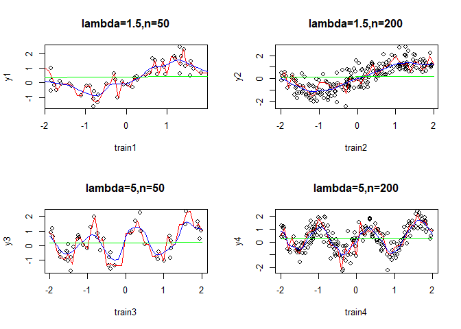<!-- -->

```r
par(mfrow=c(1,1))
```

For each h, use the Kernel Regression function
to compute or estimate the following quantities:


(a) Compute the expected optimism [Eop] of regression function based on the x’s in the training set.
(What is w? What is σ2?)


```r
only_w<- function(x,train_set,h,y){
  w<-c()
  w1 <-matrix(data = NA,nrow = length(x),ncol = length(train_set))
  for (i in 1:length(x)) {
     for (j in 1:length(train_set)) {
      w <- c(w,dnorm((x[i]-train_set[j])/h))
     }
    w1[i,] <-w/sum(w)
    w<-c()
  }
  return(w1%*%t(w1))
}

y_hat1 <-c(my_kernel(train1,train1,h[1],y1))
y_hat3 <-c(my_kernel(train3,train3,h[1],y3))
hat1 <- c()
hat3 <-c()
for (j in 2:length(h)) {
  hat1 <-c(hat1,my_kernel(train1,train1,h[j],y1))
  hat3 <-c(hat3,my_kernel(train3,train3,h[j],y3))
  y_hat1 <- cbind(y_hat1,hat1)
  y_hat3 <- cbind(y_hat3,hat3)
  hat1 <- c()
  hat3 <-c()
  }
 
y_hat2 <-c(my_kernel(train2,train2,h[1],y2))
y_hat4 <-c(my_kernel(train4,train4,h[1],y4))
hat2 <-c()
hat4 <-c()
for (j in 2:length(h)) {
  hat2 <-c(hat2,my_kernel(train2,train2,h[j],y2))
  hat4 <-c(hat4,my_kernel(train4,train4,h[j],y4))
  y_hat2 <- cbind(y_hat2,hat2)
  y_hat4 <- cbind(y_hat4,hat4)
  hat2 <-c()
  hat4 <-c()
  
}
y_hat1 <- data.frame(y_hat1)
y_hat2 <- data.frame(y_hat2)
y_hat3 <- data.frame(y_hat3)
y_hat4 <- data.frame(y_hat4)
```


```r
opt1 <-c()
for (i in 1:length(h)) {
  opt1<-c(opt1,0.3*sum(diag(only_w(x=train1,train_set = train1,h=h[i],y1))*2/50))
}
opt2 <-c()
for (i in 1:length(h)) {
  opt2<-c(opt2,0.3*sum(diag(only_w(x=train2,train_set = train2,h=h[i],y2))*2/200))
}
opt3 <-c()
for (i in 1:length(h)) {
  opt3<-c(opt3,0.3*sum(diag(only_w(x=train3,train_set = train3,h=h[i],y3))*2/50))
}
opt4 <-c()
for (i in 1:length(h)) {
  opt4<-c(opt4,0.3*sum(diag(only_w(x=train4,train_set = train4,h=h[i],y4))*2/200))
}
all_opt <- data.frame(rbind(opt1,opt2,opt3,opt4))
all_opt <- as.data.frame(t(all_opt))
all_opt %>% ggplot() + geom_line(aes(x=h,y=opt1,col="red"),size=1) + geom_line(aes(x=h,y=opt2,col="blue"),size=1)+
geom_line(aes(x=h,y=opt3,col="green"),size=1) + geom_line(aes(x=h,y=opt4,col="purple"),size=1) + scale_color_discrete(name = "combination", labels = c("lambda=1.5 n=200", "lambda=5 n=50","lambda=5 n=200","lambda=1.5 n=50")) + labs(title="Expected Optimism as a function of h") + ylab("Expected Optimism")
```

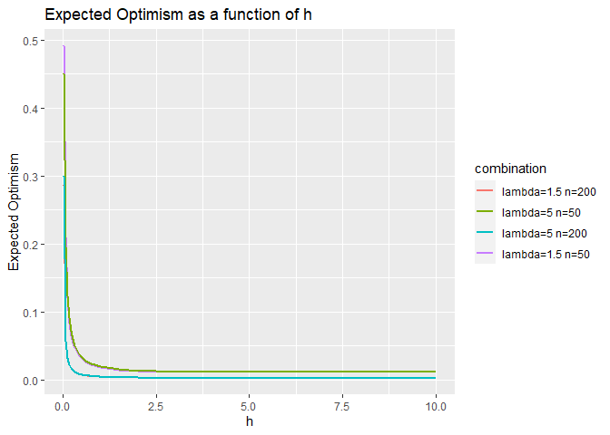<!-- -->
<br> 
Analysis: <br>
In order to calculate the $Eop$ of our models we used the formula we saw in<br> class which states that $Eop=\frac{2\sigma^2}{n}tr(w)$, where $\sigma^2=Var(\epsilon)=0.3$ and $w$ is the "weight" matrix of the linear smoother.<br>
As for the values of the $Eop$ we can see that in the lower values of $h$ the size of the sample($n$) has a key role in determining the $Eop$.<br>
But as $h$ increase we can see a sudden drop in $Eop$ valuses.
This may be explained by another definition of $Eop$ as $Eop=\frac{2}{n}\sum^{n}_{i=1}{Cov(Y_i,\hat{Y}_i)}$.
Low $h$ valuses means that there is over fitting in our model which makes $Y$ and $\hat{Y}$ highly correlated and vice versa where $h$ is high(under fitting a model and causes low correlation).<br>

(b) Estimate the accuracy of the regression using 5-fold cross-validation error. Write your own code.

```r
# first split the data to train and test
train_test1 <- cbind(train1,y1)
train_test2 <- cbind(train2,y2)
train_test3 <- cbind(train3,y3)
train_test4 <- cbind(train4,y4)
fn50 <- c(1:50)
fn50 <- split(fn50,ceiling(seq_along(fn50)/10))
fn200 <-(1:200)
fn200 <- split(fn200,ceiling(seq_along(fn200)/40))

CV1 <- c()
CV2 <- c()
CV3 <- c()
CV4 <- c()
CV1_fin <-c()
CV2_fin <-c()
CV3_fin <-c()
CV4_fin <-c()
# 5 fold cross validation for each fold and for each h
for(i in 1:length(h)) {
  for (j in 1:5){
    CV1 <- c(CV1,mean((train_test1[unlist(fn50[j]),2]-my_kernel(x=train_test1[unlist(fn50[j]),1],train_set = train_test1[-unlist(fn50[j]),1],h =h[i],y=train_test1[-unlist(fn50[j]),2]))^2))
    CV2 <- c(CV2,mean((train_test2[unlist(fn200[j]),2]-my_kernel(x=train_test2[unlist(fn200[j]),1],train_set = train_test2[-unlist(fn200[j]),1],h =h[i],y=train_test2[-unlist(fn200[j]),2]))^2))
    CV3 <- c(CV3,mean((train_test3[unlist(fn50[j]),2]-my_kernel(x=train_test3[unlist(fn50[j]),1],train_set = train_test3[-unlist(fn50[j]),1],h =h[i],y=train_test3[-unlist(fn50[j]),2]))^2))
    CV4 <- c(CV4,mean((train_test4[unlist(fn200[j]),2]-my_kernel(x=train_test4[unlist(fn200[j]),1],train_set = train_test4[-unlist(fn200[j]),1],h =h[i],y=train_test4[-unlist(fn200[j]),2]))^2))
  }
# calculating the mean of the EPE_i
CV1_fin <-c(CV1_fin,sum(CV1,na.rm = T)/5)
CV2_fin <-c(CV2_fin,sum(CV2,na.rm = T)/5)
CV3_fin <-c(CV3_fin,sum(CV3,na.rm = T)/5)
CV4_fin <-c(CV4_fin,sum(CV4,na.rm = T)/5)
CV1 <- c()
CV2 <- c()
CV3 <- c()
CV4 <- c()
}
CV_all <- data.frame(rbind(CV1_fin,CV2_fin,CV3_fin,CV4_fin))
CV_all <- as.data.frame(t(CV_all))
CV_all %>% ggplot() + geom_line(aes(x=h,y=CV1_fin,col="red"),size=1) + geom_line(aes(x=h,y=CV2_fin,col="blue"),size=1)+
geom_line(aes(x=h,y=CV3_fin,col="green"),size=1) + geom_line(aes(x=h,y=CV4_fin,col="purple"),size=1) + scale_color_discrete(name = "combination", labels = c("lambda=1.5 n=200", "lambda=5 n=50","lambda=5 n=200","lambda=1.5 n=50")) + labs(title="5-folds Cross-validations  as a function of h") + ylab("EPE CV") 
```

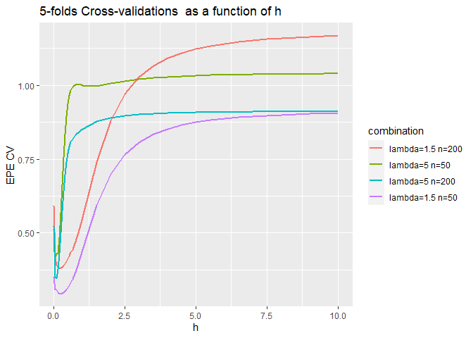<!-- -->
<br> Analysis: <br>
For our calculation we first splitted the data to 5 groups and such that each group will be a test group once.<br>
Then for each combination of train and test we caluclated $$\widehat{EPE_i}=\frac{1}{n/k}\sum_{j\in Group\space i}(\hat{f}_{-i}(x_j)-y_j)^2$$
Then calculate the mean of the groups to determine $EPE_{CV}$.
The result show a similar behaviour of the curves in each combinations of $n$ and $\lambda$. 
On lowest values of $h$ we can see that there is higher $EPE_{CV}$ rates due to the size of the sample ($n$), then the curve reaches the minimum value of  $EPE_{CV}$, and finaly increases as $h$ grows.<br>
This shape of the curve emphasizes the bias variance trade-off in our model(low $h$ means less bias and high variance and high $h$ means more bias and less variance).
Moreover, for higher values of $h$ we can see major differences in the $EPE_{CV}$ rates due to the value of $\lambda$.<br>
As $\lambda$ grows, the frequency of the $sin(\lambda x)$ waves grows which means theres is more data points in the intervals smaller of $x$.<br>
This causes the  $EPE_{CV}$ to increase faster on $lambda=5$ then on $lambda=1.5$ because it is easier to describe low frequency data with a line then high frequency data.<br>

(c) Compute the in-sample expected error (EPE IN ) of your regression for multiple values of h.
Hint: use the true regression function in Equation 1.

```r
# first sample new Y* for the same x
EPE_IN1 <- c()
EPE_IN2 <- c()
EPE_IN3 <- c()
EPE_IN4 <- c()
EPE_IN1_all <-c()
EPE_IN2_all <-c()
EPE_IN3_all <-c()
EPE_IN4_all <-c()
for (i in 1:length(h)) {
  for (j in 1:300) {
  y_star1 <- the_sam(lambda = 1.5,x=train1)
  y_star1 <- y_star1[[2]]  
  EPE_IN1<-c(EPE_IN1,mean((y_star1 -y_hat1[,i] )^2))
  }
  EPE_IN1_all <-c(EPE_IN1_all,sum(EPE_IN1,na.rm = T)/150)
  EPE_IN1 <- c()
}
for (i in 1:length(h)) {
  for (j in 1:300) {
  y_star2 <- the_sam(lambda = 1.5,x=train2)
  y_star2 <- y_star2[[2]]  
  EPE_IN2<-c(EPE_IN2,mean((y_star2- y_hat2[,i])^2))
  }
  EPE_IN2_all <-c(EPE_IN2_all,sum(EPE_IN2,na.rm = T)/150)
  EPE_IN2 <- c()
  
}
for (i in 1:length(h)) {
  for (j in 1:300) {
  y_star3 <- the_sam(lambda = 5,x=train3)
  y_star3 <- y_star3[[2]]  
  EPE_IN3<-c(EPE_IN3,mean((y_star3- y_hat3[,i])^2))
  }
  EPE_IN3_all <-c(EPE_IN3_all,sum(EPE_IN3,na.rm = T)/150)
  EPE_IN3 <- c()
}
for (i in 1:length(h)) {
  for (j in 1:300) {
  y_star4 <- the_sam(lambda = 5,x=train4)
  y_star4 <- y_star4[[2]]
  EPE_IN4<-c(EPE_IN4,mean((y_star4- y_hat4[,i])^2))
  }
  EPE_IN4_all <-c(EPE_IN4_all,sum(EPE_IN4,na.rm = T)/150)
  EPE_IN4 <- c()
}

EPE_IN_all <- data.frame(rbind(EPE_IN1_all,EPE_IN2_all,EPE_IN3_all,EPE_IN4_all))
EPE_IN_all <- as.data.frame(t(EPE_IN_all))
EPE_IN_all %>% ggplot() + geom_line(aes(x=h,y=EPE_IN1_all,col="red"),size=1) + geom_line(aes(x=h,y=EPE_IN2_all,col="blue"),size=1)+
geom_line(aes(x=h,y=EPE_IN3_all,col="green"),size=1) + geom_line(aes(x=h,y=EPE_IN4_all,col="purple"),size=1) + scale_color_discrete(name = "combination", labels = c("lambda=1.5 n=200", "lambda=5 n=50","lambda=5 n=200","lambda=1.5 n=50")) + labs(title="EPE IN  as a function of h") + ylab("EPE IN")
```

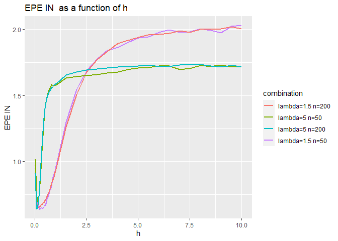<!-- -->
<br> Analysis: <br>
For our calculation we re-smapled $Y$ valuses with our trainning data and calculated $EPE_{in}$ by the formula:
$$EPE_{in}=\frac{1}{n}\sum^n_iE_{Y^*_i|X_i=x_i}(Y^*_i-\hat{f}(x_i))^2$$
where $E_{Y^*_i|X_i=x_i}(Y^*_i-\hat{f}(x_i))^2$ was replaced by mean.<br>
The result show a similar behavior to the curves seen in $EPE_{CV}$, but this time the curve seems more "broken" due to the re-samples of $Y*$.
For the lowest values of $h$ we can see that there is higher $EPE_{in}$ rates due to the size of the sample ($n$), then the curves reach the minimum value of  $EPE_{in}$ (optimal point in terms of bias variance trade-off), and finaly increases as $h$ grows.<br>
Moreover, for higher values of $h$ we can see major differences in the $EPE_{in}$ rates due to the value of $\lambda$.<br>
(this can also be explained by the change in data frequency caused by $\lambda$)


(d) Estimate the out-of-sample expected prediction error (EP E) of your regression function. (Do
this by sampling new data-points from the model).

```r
train1_new <- c()
train2_new <- c()
train3_new <- c()
train4_new <- c()
y1_new <-c()
y2_new <-c()
y3_new <-c()
y4_new <-c()
for (i in 1:40) {
  comb1_new <-the_sam(lambda = 1.5,n=50)
  train1_new <- cbind(train1_new,comb1_new[[1]])
  y1_new <- cbind(y1_new,comb1_new[[2]])
  comb2_new <-the_sam(lambda = 1.5,n=200)
  train2_new <- cbind(train2_new,comb2_new[[1]])
  y2_new <- cbind(y2_new,comb2_new[[2]])
  comb3_new <-the_sam(lambda = 5,n=50)
  train3_new <- cbind(train3_new,comb3_new[[1]])
  y3_new <- cbind(y3_new,comb3_new[[2]])
  comb4_new <-the_sam(lambda = 5,n=200)
  train4_new <- cbind(train4_new,comb4_new[[1]])
  y4_new <- cbind(y4_new,comb4_new[[2]])
}
EPE_1 <- c()
EPE_2 <- c()
EPE_3 <- c()
EPE_4 <- c()
EPE_1_all <-c()
EPE_2_all <-c()
EPE_3_all <-c()
EPE_4_all <-c()
for (i in 1:length(h)) {
  for (j in 1:40) {
  y_hat11 <- my_kernel(x=train1_new[,j],train_set = train1,h = h[i],y=y1)
  EPE_1<-c(EPE_1,mean((y1_new[,j] - y_hat11)^2))
  y_hat22 <- my_kernel(x=train2_new[,j],train_set = train2,h = h[i],y=y2)
  EPE_2<-c(EPE_2,mean((y2_new[,j] - y_hat22)^2))
  y_hat33 <- my_kernel(x=train3_new[,j],train_set = train3,h = h[i],y=y3)
  EPE_3<-c(EPE_3,mean((y3_new[,j] - y_hat33)^2))
  y_hat44 <- my_kernel(x=train4_new[,j],train_set = train4,h = h[i],y=y4)
  EPE_4<-c(EPE_4,mean((y4_new[,j] - y_hat44)^2))
  }
  EPE_1_all <-c(EPE_1_all,sum(EPE_1,na.rm = T)/40)
  EPE_1 <-c() 
  EPE_2_all <-c(EPE_2_all,sum(EPE_2,na.rm = T)/40)
  EPE_2 <-c()
  EPE_3_all <-c(EPE_3_all,sum(EPE_3,na.rm = T)/40)
  EPE_3 <-c()
  EPE_4_all <-c(EPE_4_all,sum(EPE_4,na.rm = T)/40)
  EPE_4 <- c()
}
EPE_all <- data.frame(rbind(EPE_1_all,EPE_2_all,EPE_3_all,EPE_4_all))
EPE_all <- as.data.frame(t(EPE_all))
EPE_all %>% ggplot() + geom_line(aes(x=h,y=EPE_1_all,col="red"),size=1) + geom_line(aes(x=h,y=EPE_2_all,col="blue"),size=1)+
geom_line(aes(x=h,y=EPE_3_all,col="green"),size=1) + geom_line(aes(x=h,y=EPE_4_all,col="purple"),size=1) + scale_color_discrete(name = "combination", labels = c("lambda=1.5 n=200", "lambda=5 n=50","lambda=5 n=200","lambda=1.5 n=50")) + labs(title="EPE as a function of h") + ylab("EPE")
```

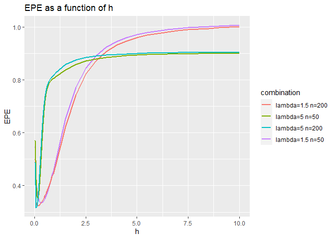<!-- -->
<br> Analysis: <br>
For this section we re-sampled pairs 40 of new $(X,Y)$ and calculated the $EPE$ as:
$$EPE[\hat{f}]=E_{XY}(L(X,Y,\hat{f})|\tau)$$
Because we can just estimate the $EPE$ we took the mean of those 40 pairs for each $h$ as the expected value of loss.<br>
The estimation of $EPE$ have a similar trend as $EPE_{in}$ and $EPE_{CV}$.
This means that there is value of $h^*$ that minimizes the $EPE$,$EPE_{in}$ and $EPE_{CV}$ but is it the same $h$ for all the $EPE's$?


```r
mini_EPE_IN <-c()
mini_EPE_CV <- c()
mini_EPE <- c()
for (i in 1:4) {
  mini_EPE <- c(mini_EPE,h[which(EPE_all[,i]==min(EPE_all[,i],na.rm = T))])
  mini_EPE_IN <- c(mini_EPE_IN,h[which(EPE_IN_all[,i]==min(EPE_IN_all[,i],na.rm = T))])
  mini_EPE_CV <- c(mini_EPE_CV,h[which(CV_all[,i]==min(CV_all[,i],na.rm = T))])
  
}
what_min <- t(data.frame(mini_EPE,mini_EPE_IN,mini_EPE_CV))
row.names(what_min)<-c("Min h EPE","Min h EPE IN","Min h EPE CV")
colnames(what_min) <-c("n=50,lambda=1.5","n=200,lambda=1.5","n=50,lambda=5","n=200,lambda=5")
kable(what_min)
```


|             | n=50,lambda=1.5| n=200,lambda=1.5| n=50,lambda=5| n=200,lambda=5|
|:------------|---------------:|----------------:|-------------:|--------------:|
|Min h EPE    |            0.31|             0.16|          0.16|           0.06|
|Min h EPE IN |            0.21|             0.16|          0.16|           0.06|
|Min h EPE CV |            0.21|             0.21|          0.06|           0.11|
It seems that there is not a global $h$ value that minimaze all the $EPE's$ for all $n$ and $\lambda$ but for each combination there is a spesific $h$(or a range of values which a minimum can be found) value that minimaze the error.  


4. Repeat these steps for a quadratic regression prediction model:
$$\hat{y}=b_1 +b_2x + b_3x^2$$
meaning that the predictor vector for x should be z = (1, x, x2)
0 and (b1, b2, b3) fit using ordinary least squares (OLS).

```r
comb1ols <-the_sam(lambda = 1.5,n=50)
comb2ols <-the_sam(lambda = 1.5,n=200)
comb3ols <-the_sam(lambda = 5,n=50)
comb4ols <-the_sam(lambda = 5,n=200)
train1ols <- comb1[[1]]
train2ols <- comb2[[1]]
train3ols <- comb3[[1]]
train4ols <- comb4[[1]]
y1ols <-comb1[[2]]
y2ols <-comb2[[2]]
y3ols <-comb3[[2]]
y4ols <-comb4[[2]]

X1 <- as.matrix(cbind(1,train1ols,train1ols^2))
X2 <-  as.matrix(cbind(1,train2ols,train2ols^2))
X3 <-  as.matrix(cbind(1,train3ols,train3ols^2))
X4 <- as.matrix(cbind(1,train4ols,train4ols^2))
lm_model1 <- lm(y1ols ~ 1 +X1[,2]+X1[,3])
lm_model2 <- lm(y2ols ~ 1 +X2[,2]+X2[,3])
lm_model3 <- lm(y3ols ~ 1 +X3[,2]+X3[,3])
lm_model4 <- lm(y4ols ~ 1 +X4[,2]+X4[,3])
damm1 <-cbind(train1ols,predict(lm_model1))
damm1 <- damm1[order(damm1[,1]),]
damm2 <-cbind(train2ols,predict(lm_model2))
damm2 <- damm2[order(damm2[,1]),]
damm3 <-cbind(train3ols,predict(lm_model3))
damm3 <- damm3[order(damm3[,1]),]
damm4 <-cbind(train4ols,predict(lm_model4))
damm4 <- damm4[order(damm4[,1]),]
par(mfrow=c(2,2))
plot(train1ols,y1ols)
lines(damm1[,1],damm1[,2],col="red",lw=2)
plot(train2ols,y2ols)
lines(damm2[,1],damm2[,2],col="red",lw=2)
plot(train3ols,y3ols)
lines(damm3[,1],damm3[,2],col="red",lw=2)
plot(train4ols,y4ols)
lines(damm4[,1],damm4[,2],col="red",lw=2)
```

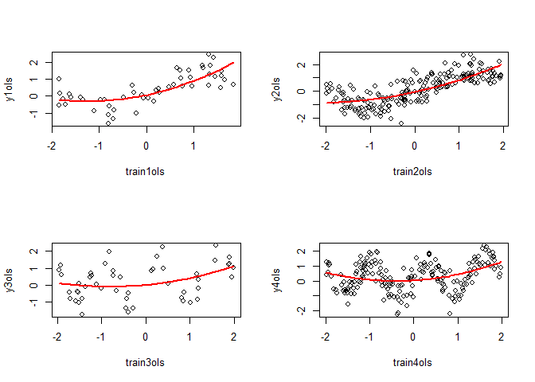<!-- -->

```r
par(mfrow=c(1,1))
```


```r
opt1ols<- 3*0.3*(2/50)
opt2ols<- 3*0.3*(2/200)
opt3ols<- 3*0.3*(2/50)
opt4ols<- 3*0.3*(2/200)
all_opt_ols <- data.frame(opt1ols,opt2ols,opt3ols,opt4ols,row.names = c("optimisem"))
colnames(all_opt_ols)[1:4] <- c("n=50,lambda=1.5","n=200,lambda=1.5","n=50,lambda=5","n=200,lambda=5")
kable(all_opt_ols)
```


|          | n=50,lambda=1.5| n=200,lambda=1.5| n=50,lambda=5| n=200,lambda=5|
|:---------|---------------:|----------------:|-------------:|--------------:|
|optimisem |           0.036|            0.009|         0.036|          0.009|
<br> Analysis: <br>
The $Eop$ was estimated by the same formula used in the last section which is
$$Eop=\frac{2\sigma^2}{n}tr(w)$$
the only difference is that we know $\sigma^2=0.3$ and $w=X(X^TX)^{-1}X^T$ which means that  $tr(w)=p$ so the only parameter that determents the optimism between the combination is the sample size $n$.


```r
set.seed(43)
# first split the data to train and test
X1 <- cbind(X1,y1ols)
X2 <- cbind(X2,y2ols)
X3 <- cbind(X3,y3ols)
X4 <- cbind(X4,y4ols)
fn50 <- 1:50
fn50 <- split(fn50,ceiling(seq_along(fn50)/10))
fn200 <-1:200
fn200 <- split(fn200,ceiling(seq_along(fn200)/40))

CV1 <- c()
CV2 <- c()
CV3 <- c()
CV4 <- c()


  for (j in 1:5){
    lean1 <- lm(X1[-unlist(fn50[j]),4] ~ 1 + X1[-unlist(fn50[j]),2]+ X1[-unlist(fn50[j]),3])
    CV1 <- c(CV1,mean((X1[unlist(fn50[j]),1:3]%*%c(lean1$coefficients)-X1[unlist(fn50[j]),4])^2))
  lean2 <- lm(X2[-unlist(fn200[j]),4] ~ 1 + X2[-unlist(fn200[j]),2]+ X2[-unlist(fn200[j]),3])
    CV2 <- c(CV2,mean((X2[unlist(fn200[j]),1:3]%*%c(lean2$coefficients)-X2[unlist(fn200[j]),4])^2))
    lean3 <- lm(X3[-unlist(fn50[j]),4] ~ 1 + X3[-unlist(fn50[j]),2]+ X3[-unlist(fn50[j]),3])
    CV3 <- c(CV3,mean((X3[unlist(fn50[j]),1:3]%*%c(lean3$coefficients)-X3[unlist(fn50[j]),4])^2))
  lean4 <- lm(X4[-unlist(fn200[j]),4] ~ 1 + X4[-unlist(fn200[j]),2]+ X4[-unlist(fn200[j]),3])
    CV4 <- c(CV4,mean((X4[unlist(fn200[j]),1:3]%*%c(lean4$coefficients)-X4[unlist(fn200[j]),4])^2))
    
  }
CV1 <-c(mean(CV1))
CV2 <-c(mean(CV2))
CV3 <-c(mean(CV3))
CV4 <-c(mean(CV4))
all_CV_ols <- data.frame(CV1,CV2,CV3,CV4,row.names = c("EPE CV"))
colnames(all_CV_ols)[1:4] <- c("n=50,lambda=1.5","n=200,lambda=1.5","n=50,lambda=5","n=200,lambda=5")
kable(all_CV_ols)
```


|       | n=50,lambda=1.5| n=200,lambda=1.5| n=50,lambda=5| n=200,lambda=5|
|:------|---------------:|----------------:|-------------:|--------------:|
|EPE CV |       0.4061728|        0.5128527|     0.9871223|      0.8022509|
<br> Analysis: <br>
For this section we used the cross validation to estimate the $EPE_{CV}$.<br>
The result shows that $\lambda$ is the main effector to the model  $EPE_{CV}$.
This can be explained by the role of $\lambda$ as a paremeter of sin wave frequency. 
Lower values of $\lambda$ create "wider" sin waves which makes it easier for our model to fit the data.<br>
On the other hand high values of $\lambda$ create more "densed" sin waves which make it harder for our model to fit the the data.<br>
It is also important to notice that even if we use a second degree taylor expansion on $sin(\lambda x)$ we get:
$$sin(\lambda x)=\lambda x -\frac{(\lambda x)^3}{3!}+R_n(\lambda x)$$
Meaning we are trying to fit a second drgree polynomial on a third degree polynomial so we can expect to see high error rates.<br>

(c) Compute the in-sample expected error (EPE IN ) of your regression 


```r
# first sample new Y* for the same x
EPE_IN1ols <- c()
EPE_IN2ols <- c()
EPE_IN3ols <- c()
EPE_IN4ols <- c()

for (j in 1:150) {
  y_star1 <- the_sam(lambda = 1.5,x=train1ols)
  y_star1 <- y_star1[[2]]
  lean1 <- lm(X1[,4] ~ 1 + X1[,2] + X1[,3])
  EPE_IN1ols<-c(EPE_IN1ols,mean((y_star1 -X1[,1:3]%*%c(lean1$coefficients))^2))
}
  EPE_IN1ols <-c(sum(EPE_IN1ols)/150)

for (j in 1:150) {
  y_star2 <- the_sam(lambda = 5,x=train2ols)
  y_star2 <- y_star2[[2]]
  lean2 <- lm(X2[,4] ~ 1 + X2[,2] + X2[,3])
  EPE_IN2ols<-c(EPE_IN2ols,mean((y_star2 -X2[,1:3]%*%c(lean2$coefficients))^2))
  }
  EPE_IN2ols <-c(sum(EPE_IN2ols)/150)

for (j in 1:150) {
  y_star3 <- the_sam(lambda = 1.5,x=train3ols)
  y_star3 <- y_star3[[2]]
  lean3 <- lm(X3[,4] ~ 1 + X3[,2] + X3[,3])
  EPE_IN3ols<-c(EPE_IN3ols,mean((y_star3 -X3[,1:3]%*%c(lean3$coefficients))^2))
}
  EPE_IN3ols <-c(sum(EPE_IN3ols)/150)

for (j in 1:150) {
  y_star4 <- the_sam(lambda = 5,x=train4ols)
  y_star4 <- y_star4[[2]]
  lean4 <- lm(X4[,4] ~ 1 + X4[,2] + X4[,3])
  EPE_IN4ols<-c(EPE_IN4ols,mean((y_star4 -X4[,1:3]%*%c(lean4$coefficients))^2))
  }
  EPE_IN4ols <-c(sum(EPE_IN4ols)/150)

  
all_EPE_INols <- data.frame(EPE_IN1ols,EPE_IN2ols,EPE_IN3ols,EPE_IN4ols,row.names = c("EPE IN ols"))
colnames(all_EPE_INols)[1:4] <- c("n=50,lambda=1.5","n=200,lambda=1.5","n=50,lambda=5","n=200,lambda=5")
kable(all_EPE_INols)
```


|           | n=50,lambda=1.5| n=200,lambda=1.5| n=50,lambda=5| n=200,lambda=5|
|:----------|---------------:|----------------:|-------------:|--------------:|
|EPE IN ols |       0.4159383|         1.079831|     0.6089134|       0.754748|
<br> Analysis: <br>
For this section we calculated the $EPE_{in}$ using we new $Y$ samples.<br>
The result shows that there is the significant effect of the sample size $n$
for lower values of $\labmbda$ on the $EPE_{in}$.
This may be expained by the effects of $\lambda$ on the curve.
If we take a look of the plot of $n=50,\lambda=1.5$ and $n=200,\lambda=1.5$
we can see that many points are under/above the regression line.
For lower $n$ and low $\lambda$ it is harder to see the "true" pattern of the data so new y values do not have a major effect on the error rates.
On the other hand, higher $n$ and low $\lambda$  reveal the "true" pattern of the data so new y values can be significantly differ and effect the error rates.
This problem can not be seen on high values of $\lambda$ because the data "true" pattern can be seen even in low values of $n$ so adding more data does not effect the error rates much (the error is already high and it stays high).


```r
# first create models for first train
lean1 <- lm(y1ols ~ 1 + X1[,2] + X1[,3])$coefficients
lean2 <- lm(y2ols ~ 1 + X2[,2] + X2[,3])$coefficients
lean3 <- lm(y3ols ~ 1 + X3[,2] + X3[,3])$coefficients
lean4 <- lm(y4ols ~ 1 + X4[,2] + X4[,3])$coefficients
EPE_1ols <- c()
EPE_2ols <- c()
EPE_3ols <- c()
EPE_4ols <- c()
for (i in 1:150) {
comb1ols <-the_sam(lambda = 1.5,n=50)
X1_n <- cbind(1,comb1ols[[1]],comb1ols[[1]]^2)
EPE_1ols <- c(EPE_1ols,mean((X1_n%*%lean1 -comb1ols[[2]])^2))
comb2ols <-the_sam(lambda = 1.5,n=200)
X2_n <- cbind(1,comb2ols[[1]],comb2ols[[1]]^2)
EPE_2ols <- c(EPE_2ols,mean((X2_n%*%lean2 -comb2ols[[2]])^2))
comb3ols <-the_sam(lambda = 5,n=50)
X3_n <- cbind(1,comb3ols[[1]],comb3ols[[1]]^2)
EPE_3ols <- c(EPE_3ols,mean((X3_n%*%lean3 -comb3ols[[2]])^2))
comb4ols <-the_sam(lambda = 5,n=200)
X4_n <- cbind(1,comb4ols[[1]],comb4ols[[1]]^2)
EPE_4ols <- c(EPE_4ols,mean((X4_n%*%lean3 -comb4ols[[2]])^2))
}
EPE_1ols <-c(mean(EPE_1ols))
EPE_2ols<-mean(EPE_2ols)
EPE_3ols<-mean(EPE_3ols)
EPE_4ols<-mean(EPE_4ols)
all_EPE_ols <- data.frame(EPE_1ols,EPE_2ols,EPE_3ols,EPE_4ols,row.names = c("EPE ols"))
colnames(all_EPE_ols)[1:4] <- c("n=50,lambda=1.5","n=200,lambda=1.5","n=50,lambda=5","n=200,lambda=5")
kable(all_EPE_ols)
```


|        | n=50,lambda=1.5| n=200,lambda=1.5| n=50,lambda=5| n=200,lambda=5|
|:-------|---------------:|----------------:|-------------:|--------------:|
|EPE ols |       0.4526932|        0.4592292|     0.7920548|      0.7897695|
<br> Analysis: <br>
For this section we calculated the $EPE$ using we new $Y,X$ samples.<br>
The result show that $\lambda$ is the main effect on the model  $EPE$.
This can be also explained by the role of $\lambda$ as a paremeter of sin wave frequency.(A same argument in the $EPE_{CV}$ section) 


### Question 2

Please prepare the following two plots: <br>
#### 1. A figure showing the number of new detected Covid-19 cases per day, with both the observed values<br>
and a regression curve. The regression should be estimated outside the figure (do not use ggsmooth).<br>
Make sure the regression line is easy to see (you can make the true points small or in light color).

<br> <br>
Preparing the data

```r
Corona_data <- read.csv("Corona_cases_Israel.csv")
Corona_data[3] <- cumsum(Corona_data[,2])
Corona_data[,1] <- seq(as.Date("2020-2-12"), as.Date("2021-5-31"), by="days")
Corona_data[,4] <- seq(1,length(Corona_data[,1]))
colnames(Corona_data) <- c("Date", "Verified_cases", "Total_cases", "Date_num")
```

The kernel function for this question will be the same kernel function we implemented in Question 1.

A figure showing the number of new detected Covid-19 cases per day, with both the observed values
and a regression curve.<br><br>

We will show 3 different implementation of kernel prediction:<br>
1. Over fit implementation, with low bandwith. <br>
2. Nice fit implementation, with moderate bandwidth. <br
3. Under fit implementation <br><br>

Inductory explanation of the graph - observed values in blue, regression curve in red and the starting dates of the quarantines in black vertical line.

Firstly, overfit:

```r
# 2.a

# Base graph
colors <- c("Verified cases" = "blue", "Predicted cases" = "red", "Start of quarantine" = "black")
corona <-ggplot(Corona_data, aes(x=Date, y=Verified_cases)) + geom_point(aes(color = "Verified cases")) + labs(x="Date",y="Verified cases per day", color ="Legend") + geom_vline(xintercept=c(as.numeric(Corona_data$Date[43]),as.numeric(Corona_data$Date[220]), as.numeric(Corona_data$Date[320])), linetype=4) + scale_color_manual(values = colors)

# Prediction prepare - overfit

kernel_regression <- as.data.frame(my_kernel(Corona_data$Date_num, Corona_data$Date_num, 0.5, Corona_data$Verified_cases))
kernel_regression <- cbind(Corona_data[,1], kernel_regression)
colnames(kernel_regression) <- c("Date", "Prediction")


# Overfit graph
corona + geom_line(data = kernel_regression, aes(x=Date,y=Prediction, color = "Predicted cases"), size = 0.75)  + ggtitle("Verified & predicted cases of Covid-19 in Israel", subtitle = "Overfit - bandwidth of 0.5")
```

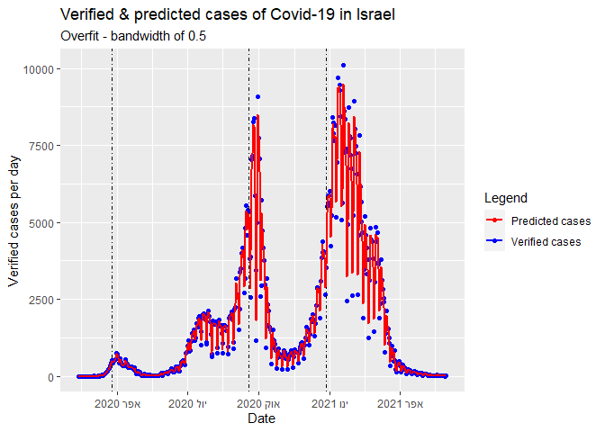<!-- -->

As we see in the graph, the regression curve is highly overfit to the observed values. The kernel prediction is based on bandwidth of 0.5.<br>

<br>
Good fit:


```r
# Prediction prepare - goodfit
kernel_regression <- as.data.frame(my_kernel(Corona_data$Date_num, Corona_data$Date_num, 3, Corona_data$Verified_cases))
kernel_regression <- cbind(Corona_data[,1], kernel_regression)
colnames(kernel_regression) <- c("Date", "Prediction")


# Goodfit graph
corona + geom_line(data = kernel_regression, aes(x=Date,y=Prediction, color = "Predicted cases"), size = 1.15) + ggtitle("Verified & predicted cases of Covid-19 in Israel", subtitle = "Good fit - bandwidth of 3")
```

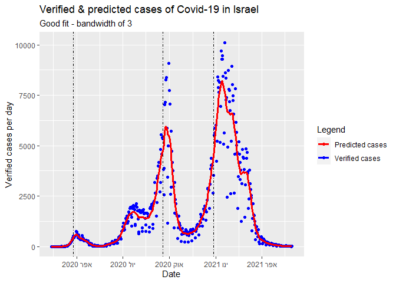<!-- -->

In contrast to the overfit, we see that the regression curve doesn't "chase" the outliers and the "micro-trends" of the observed value, thus reflecting best the overall trend. The kernel prediction is based on bandwidth of 3.<br>
<br>
Underfit:


```r
# Prediction prepare - underfit
kernel_regression <- as.data.frame(my_kernel(Corona_data$Date_num, Corona_data$Date_num, 15, Corona_data$Verified_cases))
kernel_regression <- cbind(Corona_data[,1], kernel_regression)
colnames(kernel_regression) <- c("Date", "Prediction")

# Underfit graph
corona + geom_line(data = kernel_regression, aes(x=Date,y=Prediction, color = "Predicted cases"), size = 1.15) + ggtitle("Verified & predicted cases of Covid-19 in Israel", subtitle = "Underfit - bandwidth of 15")
```

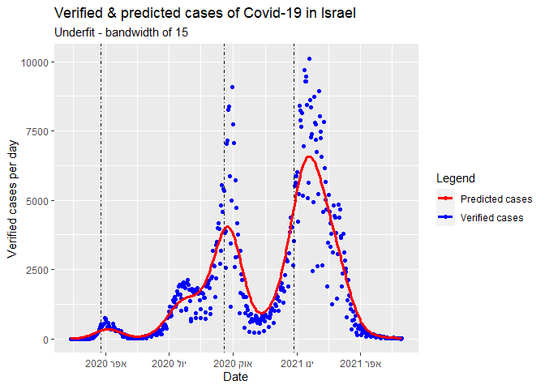<!-- -->

Expanding the change from overfit to nice fit, the underfit graph smoothes the trend too much, shading the intensity of the trends. The kernel prediction is based on bandwidth of 15.<br>
<br>

2. A figure showing the daily change in rate of new detections per day. To estimate these use the firstderivative of the regression curve from Part 1. <br>
<br>
As previously, the graph below also uses the same colors (observed daily change - blue, Predicted daily change - red, starting day of quarantines) <br>

Overfit:

```r
# 2.b

colors <- c("Daily change in reality" = "blue", "Predicted daily change" = "red", "Start of quarantine" = "black")

# low bandwith
kernel_regression <- as.data.frame(my_kernel(Corona_data$Date_num, Corona_data$Date_num, 0.5, Corona_data$Verified_cases))
kernel_regression <- cbind(Corona_data[,1], kernel_regression)

kernel_regression <- cbind(kernel_regression, rep(0, times=length(kernel_regression[,2])))
for (i in 2:length(kernel_regression[,2])){
  kernel_regression[i,3] <- kernel_regression[i,2] - kernel_regression[i-1,2]
}

Corona_data <- cbind(Corona_data, rep(0, times=length(Corona_data[,2])))
for (i in 2:length(Corona_data[,4])){
  Corona_data[i,5] <- Corona_data[i,2] - Corona_data[i-1,2]
}

colnames(kernel_regression) <- c("Date", "Prediction", "Slope")
colnames(Corona_data) <- c("Date", "Verified_cases", "Total_cases", "Date_num", "Slope")

corona_b <-ggplot(Corona_data, aes(x=Date, y=Slope)) + geom_point(aes(color = "Daily change in reality")) + labs(x="Date",y="Daily change in verified cases", color ="Legend") + geom_vline(xintercept=c(as.numeric(Corona_data$Date[43]),as.numeric(Corona_data$Date[220]), as.numeric(Corona_data$Date[320])), linetype=4) + scale_color_manual(values = colors)

corona_b + geom_line(data = kernel_regression, aes(x=Date,y=Slope, color = "Predicted daily change"), size = 1.15) + ggtitle("Verified & predicted cases of Covid-19 in Israel",subtitle ="Overfit - bandwidth of 0.5")
```

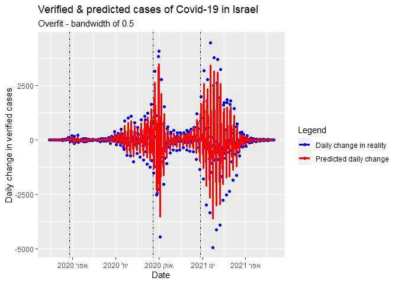<!-- -->
<br>Nice fit:

```r
# nice bandwith
kernel_regression <- as.data.frame(my_kernel(Corona_data$Date_num, Corona_data$Date_num, 1.5, Corona_data$Verified_cases))
kernel_regression <- cbind(Corona_data[,1], kernel_regression)

kernel_regression <- cbind(kernel_regression, rep(0, times=length(kernel_regression[,2])))
for (i in 2:length(kernel_regression[,2])){
  kernel_regression[i,3] <- kernel_regression[i,2] - kernel_regression[i-1,2]
}

Corona_data <- cbind(Corona_data, rep(0, times=length(Corona_data[,2])))
for (i in 2:length(Corona_data[,4])){
  Corona_data[i,5] <- Corona_data[i,2] - Corona_data[i-1,2]
}

colnames(kernel_regression) <- c("Date", "Prediction", "Slope")
colnames(Corona_data) <- c("Date", "Verified_cases", "Total_cases", "Date_num", "Slope")

corona_b <-ggplot(Corona_data, aes(x=Date, y=Slope)) + geom_point(aes(color = "Daily change in reality")) + labs(x="Date",y="Daily change in verified cases", color ="Legend") + geom_vline(xintercept=c(as.numeric(Corona_data$Date[43]),as.numeric(Corona_data$Date[220]), as.numeric(Corona_data$Date[320])), linetype=4) + scale_color_manual(values = colors)

corona_b + geom_line(data = kernel_regression, aes(x=Date,y=Slope, color = "Predicted daily change"), size = 1.15) + ggtitle("Verified & predicted cases of Covid-19 in Israel", subtitle = "Nice fit - bandwidth of 1.5")
```

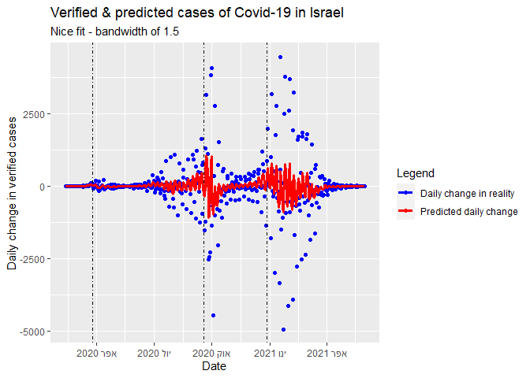<!-- -->
<br>Underfit:

```r
# bad bandwidth
kernel_regression <- as.data.frame(my_kernel(Corona_data$Date_num, Corona_data$Date_num, 5, Corona_data$Verified_cases))
kernel_regression <- cbind(Corona_data[,1], kernel_regression)

kernel_regression <- cbind(kernel_regression, rep(0, times=length(kernel_regression[,2])))
for (i in 2:length(kernel_regression[,2])){
  kernel_regression[i,3] <- kernel_regression[i,2] - kernel_regression[i-1,2]
}

Corona_data <- cbind(Corona_data, rep(0, times=length(Corona_data[,2])))
for (i in 2:length(Corona_data[,4])){
  Corona_data[i,5] <- Corona_data[i,2] - Corona_data[i-1,2]
}

colnames(kernel_regression) <- c("Date", "Prediction", "Slope")
colnames(Corona_data) <- c("Date", "Verified_cases", "Total_cases", "Date_num", "Slope")

corona_b <-ggplot(Corona_data, aes(x=Date, y=Slope)) + geom_point(aes(color = "Daily change in reality")) + labs(x="Date",y="Daily change in verified cases", color ="Legend") + geom_vline(xintercept=c(as.numeric(Corona_data$Date[43]),as.numeric(Corona_data$Date[220]), as.numeric(Corona_data$Date[320])), linetype=4) + scale_color_manual(values = colors)

corona_b + geom_line(data = kernel_regression, aes(x=Date,y=Slope, color = "Predicted daily change"), size = 1.15) + ggtitle("Verified & predicted cases of Covid-19 in Israel",subtitle = "Under fit - bandwidth of 5")
```

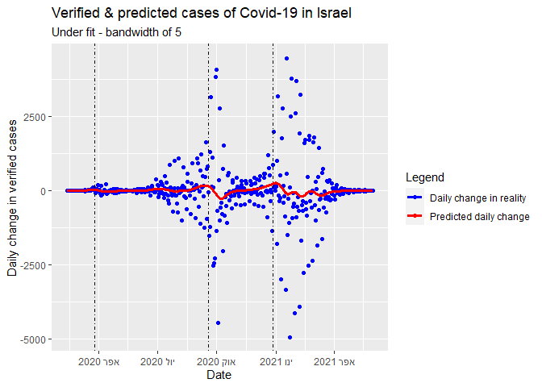<!-- -->


As noted in the graphs above, the good fit is explaining the trend better than the other bandwidths. <br>
Epidemiological note, we can see that as quarantines start, the observed values and regression curve peaks and than crashes, meaning the quarantine worked.<br>
Next, note that in the daily change graphs, we see a "heartbeat" curve, that explained by the fact that in Israel the day with lowest Covid-19 test is Saturday, probably similar to Sunday in Christian countries. <br>


<br>
### Question 3
We will fit prediction models for the response voxels (Y) in V1 in response to natural images (X). The data
consists of 3 measured responses to each image (at 3 locations, voxels, in the brain). Your main goal is to
predict the response of each voxel to new images. The secondary goal is to interpret the prediction models
in relation to the scientific problem.
We will fit models using the (n = 1500) training examples, and estimate the accuracy of prediction on
n
∗ = 250 validation examples. The training data consists of the BOLD response summary of voxel to 1500
images. I will provide 3 different responses, meaning that you will fit 3 separate regression models.
The prediction models should be able to predict a response for out-of-sample images. We will validate thier
accuracy based on how well they predict the validation data:


```r
train_rsep <-read.csv(header = T,file="train_resp.csv",row.names = 1)
Y1 <- train_rsep[,1]
Y2 <-train_rsep[,2]
Y3 <-train_rsep[,3]
X <-read.csv(header = T,file="feature_train.csv",row.names = 1)
X_NEW <-read.csv(header = T,file="feature_valid.csv",row.names = 1)
```

3.1 For each voxel, fit a linear model of the features. Because there are more features than responses, some
method for high-dimensional regression will be needed. Consider using a data-splitting technique to estimate
the success of your model, which will be faster than using cross validation.


<br>Answer<br>
For the feature selection we wanted to choose between ridge and lasso regression
so we ran the two models for thier optimal lambda and saw which model is the best for each Y


```r
set.seed(75)
testing <- c(sample(1:dim(X)[1],250,replace = F)) # first we split to train and #test

# then, we corss validate our model in order to choose lambda that minimaze the mse
ridge1 <- cv.glmnet(as.matrix(X[-testing,]),as.matrix(Y1[-testing]),alpha = 0)
ridge2 <- cv.glmnet(as.matrix(X[-testing,]),as.matrix(Y2[-testing]),alpha = 0)
ridge3 <- cv.glmnet(as.matrix(X[-testing,]),as.matrix(Y3[-testing]),alpha = 0)
lasso1 <- cv.glmnet(as.matrix(X[-testing,]),as.matrix(Y1[-testing]),alpha = 1)
lasso2 <- cv.glmnet(as.matrix(X[-testing,]),as.matrix(Y2[-testing]),alpha = 1)
lasso3 <- cv.glmnet(as.matrix(X[-testing,]),as.matrix(Y3[-testing]),alpha = 1)
ridge1_reg <- glmnet(as.matrix(X[-testing,]),as.matrix(Y1[-testing]),alpha = 0,lambda = ridge1$lambda.min)
ridge2_reg <- glmnet(as.matrix(X[-testing,]),as.matrix(Y2[-testing]),alpha = 0,lambda = ridge2$lambda.min)
ridge3_reg <- glmnet(as.matrix(X[-testing,]),as.matrix(Y3[-testing]),alpha = 0,lambda = ridge3$lambda.min)
lasso1_reg <- glmnet(as.matrix(X[-testing,]),as.matrix(Y1[-testing]),alpha = 1,lambda = lasso1$lambda.min)
lasso2_reg <- glmnet(as.matrix(X[-testing,]),as.matrix(Y2[-testing]),alpha = 1,lambda = lasso2$lambda.min)
lasso3_reg <- glmnet(as.matrix(X[-testing,]),as.matrix(Y3[-testing]),alpha = 1,lambda = lasso3$lambda.min)
ridge1_pred <- predict(ridge1_reg,s=ridge1$lambda.min,as.matrix(X[-testing,]))
ridge2_pred <- predict(ridge2_reg,s=ridge2$lambda.min,as.matrix(X[-testing,]))
ridge3_pred <- predict(ridge3_reg,s=ridge3$lambda.min,as.matrix(X[-testing,]))
lasso1_pred <- predict(lasso1_reg,s=lasso1$lambda.min,as.matrix(X[-testing,]))
lasso2_pred <- predict(lasso2_reg,s=lasso2$lambda.min,as.matrix(X[-testing,]))
lasso3_pred <- predict(lasso3_reg,s=lasso3$lambda.min,as.matrix(X[-testing,]))
all_ridge<-rbind(mean((ridge1_pred-Y1[-testing])^2),mean((ridge2_pred-Y2[-testing])^2),mean((ridge3_pred -Y3[-testing])^2))
all_lasso<-rbind(mean((lasso1_pred-Y1[-testing])^2),mean((lasso2_pred-Y2[-testing])^2),mean((lasso3_pred -Y3[-testing])^2))
daf <- data.frame(cbind(all_ridge,all_lasso),row.names = c("Y1","Y2","Y3"))
colnames(daf) <- c("Ridge MSE","Lasso MSE")
kable(daf)
```


|   | Ridge MSE| Lasso MSE|
|:--|---------:|---------:|
|Y1 | 0.5546754| 0.6998906|
|Y2 | 0.7180537| 0.7604625|
|Y3 | 0.9867379| 1.0101430|
It seens that ridge regression has low mse across all Y so we choose ridge regression for all 3 Y.
Note, that we used 1250 observation to train our model and we chose the model by
it's performence(after cross validation of the lambdas).
Now that we chose the model we will fit the model to the validation data.

```r
predi1 <- predict(ridge1_reg,s=ridge1$lambda.min,as.matrix(X_NEW))
predi2 <- predict(ridge2_reg,s=ridge2$lambda.min,as.matrix(X_NEW))
predi3 <- predict(ridge3_reg,s=ridge3$lambda.min,as.matrix(X_NEW))

pred_test1 <-predict(ridge1_reg,s=ridge1$lambda.min,as.matrix(X[testing,]))
pred_test2 <-predict(ridge2_reg,s=ridge2$lambda.min,as.matrix(X[testing,]))
pred_test3 <-predict(ridge3_reg,s=ridge3$lambda.min,as.matrix(X[testing,]))
```


3.2 Choose the voxel (1 response of the 3) for which you model works best. You goal is to get insight about how
your model works, and try to use what you learned to further improve the model.


• Feature covariates: Use a metric to identify several important features in your model. Explain your
choice of metric. What do those features have in common (location in the image, orientation, level of
the pyramid)?


<br>Answer<br>

```r
betas <- c()
for (i in 1:dim(X)[2]) {
  betas <- cbind(betas,as.matrix(X[-testing,i])*ridge1_reg$beta@x[i])
}
betas <- apply(betas,2, sd)
impo <- as.data.frame((betas))
ord <- order(impo[,1],decreasing = T)[1:100]
top_10_impo <- impo[ord,1]
load("feature_pyramid.RData")
wav_pyr_real= as.matrix(wav_pyr_real)
wav_pyr_im= as.matrix(wav_pyr_im)
par(mfrow=c(2,4))
image(t(matrix(wav_pyr_real[,ord[1]], nrow = 128)[128:1,]),col = grey.colors(100),main = "Real top feature 1")
image(t(matrix(wav_pyr_real[,ord[2]], nrow = 128)[128:1,]),col = grey.colors(100),main = "Real top feature 2")
image(t(matrix(wav_pyr_real[,ord[3]], nrow = 128)[128:1,]),col = grey.colors(100),main = "Real top feature 3")
image(t(matrix(wav_pyr_real[,ord[4]], nrow = 128)[128:1,]),col = grey.colors(100),main = "Real top feature 4")
image(t(matrix(wav_pyr_real[,ord[5]], nrow = 128)[128:1,]),col = grey.colors(100),main = "Real top feature 5")
image(t(matrix(wav_pyr_real[,ord[6]], nrow = 128)[128:1,]),col = grey.colors(100),main = "Real top feature 6")
image(t(matrix(wav_pyr_real[,ord[7]], nrow = 128)[128:1,]),col = grey.colors(100),main = "Real top feature 7")
image(t(matrix(wav_pyr_real[,ord[8]], nrow = 128)[128:1,]),col = grey.colors(100),main = "Real top feature 8")
```

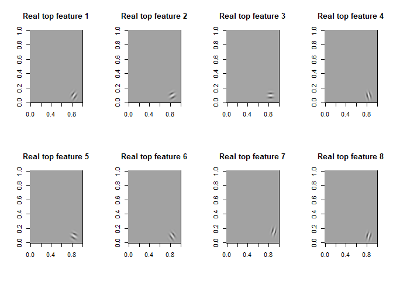<!-- -->

```r
par(mfrow=c(1,1))

par(mfrow=c(2,4))
image(t(matrix(wav_pyr_im[,ord[1]], nrow = 128)[128:1,]),col = grey.colors(100),main = "Imaginary top feature 1")
image(t(matrix(wav_pyr_im[,ord[2]], nrow = 128)[128:1,]),col = grey.colors(100),main = "Imaginary top feature 2")
image(t(matrix(wav_pyr_im[,ord[3]], nrow = 128)[128:1,]),col = grey.colors(100),main = "Imaginary top feature 3")
image(t(matrix(wav_pyr_im[,ord[4]], nrow = 128)[128:1,]),col = grey.colors(100),main = "Imaginary top feature 4")
image(t(matrix(wav_pyr_im[,ord[5]], nrow = 128)[128:1,]),col = grey.colors(100),main = "Imaginary top feature 5")
image(t(matrix(wav_pyr_im[,ord[6]], nrow = 128)[128:1,]),col = grey.colors(100),main = "Imaginary top feature 6")
image(t(matrix(wav_pyr_im[,ord[7]], nrow = 128)[128:1,]),col = grey.colors(100),main = "Imaginary top feature 7")
image(t(matrix(wav_pyr_im[,ord[8]], nrow = 128)[128:1,]),col = grey.colors(100),main = "Imaginary top feature 8")
```

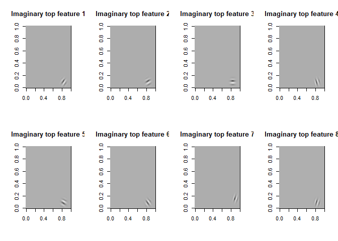<!-- -->

```r
par(mfrow=c(1,1))
```

Suppose the next metric for feature covariates picking: <br>
Consider $\beta_i$ to be more "important" than another, if it's SD multiplied by $X_i$ is greater than another combination, as followed:
$$Max (SD(\beta_i*X_i), SD(\beta_j*X_j)) $$
We chose this metric, in order to pick the greatest $\beta_i$, without the influence of $SD(X_i)$.<br>
Looking at the first 8 features, chosen by this metric, we can see that in the same placement in the images, and in the same level in the pyramid, but in different orientation.


Furthermore, with 100 features, we can detect a repeating pattern:

```r
image(t(matrix(wav_pyr_real[,ord], nrow = 128)[128:1,]),col = grey.colors(100),main = "Real top 100 features")
```

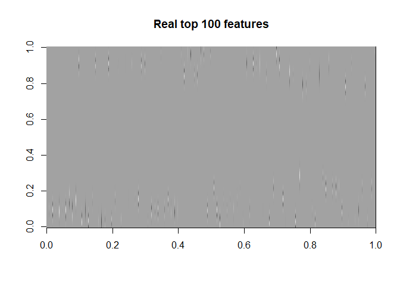<!-- -->

As we can notice in the picture, the features are centering in the top and bottom edeges of the picture.


• Linearity of response: Take the single most important feature, and plot its relation with the response. Does the plot suggest a linear relation? Plot the predictions and the responses. Do they look
linear?


<br>Answer<br>

```r
big_beta<-ridge1_reg$beta
big_beta <-cbind(1:length(big_beta@x),big_beta@x)
max_beta <- which(abs(big_beta[,2])==max(abs(big_beta[,2])))
par(mfrow=c(1,2))
plot(X[-testing,max_beta],Y1[-testing],main="before log transform",ylab="Y",xlab = "max beta fiture")
abline(lm(Y1[-testing] ~ X[-testing,max_beta]),col="blue")
plot(sqrt(X[-testing,max_beta]),Y1[-testing],main="after log transform",ylab="Y",xlab = "max beta fiture")
abline(lm(Y1[-testing] ~ log(X[-testing,max_beta])),col="blue")
```

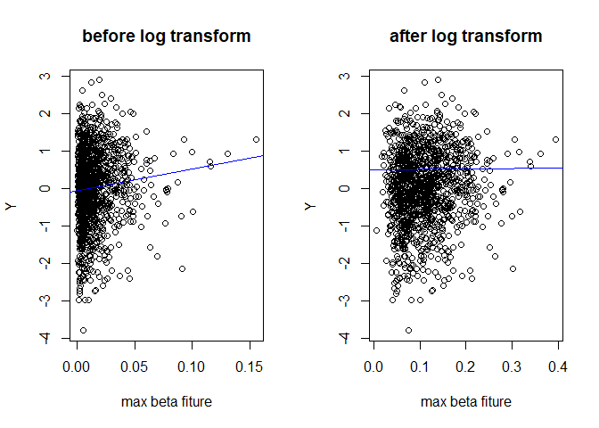<!-- -->

```r
par(mfrow=c(1,1))

print(summary(lm(Y1[-testing] ~1 +  X[-testing,max_beta])))
```

```
## 
## Call:
## lm(formula = Y1[-testing] ~ 1 + X[-testing, max_beta])
## 
## Residuals:
##     Min      1Q  Median      3Q     Max 
## -3.7737 -0.6031  0.0648  0.6971  2.8526 
## 
## Coefficients:
##                       Estimate Std. Error t value Pr(>|t|)   
## (Intercept)           -0.06239    0.03889  -1.604  0.10892   
## X[-testing, max_beta]  5.80197    1.78576   3.249  0.00119 **
## ---
## Signif. codes:  0 '***' 0.001 '**' 0.01 '*' 0.05 '.' 0.1 ' ' 1
## 
## Residual standard error: 1.001 on 1248 degrees of freedom
## Multiple R-squared:  0.008387,	Adjusted R-squared:  0.007593 
## F-statistic: 10.56 on 1 and 1248 DF,  p-value: 0.001189
```

```r
print(summary(lm(Y1[-testing] ~1 +  log(X[-testing,max_beta]))))
```

```
## 
## Call:
## lm(formula = Y1[-testing] ~ 1 + log(X[-testing, max_beta]))
## 
## Residuals:
##     Min      1Q  Median      3Q     Max 
## -3.7751 -0.6140  0.0558  0.6974  2.8046 
## 
## Coefficients:
##                            Estimate Std. Error t value Pr(>|t|)    
## (Intercept)                 0.49897    0.13370   3.732 0.000198 ***
## log(X[-testing, max_beta])  0.10168    0.02799   3.633 0.000291 ***
## ---
## Signif. codes:  0 '***' 0.001 '**' 0.01 '*' 0.05 '.' 0.1 ' ' 1
## 
## Residual standard error: 1 on 1248 degrees of freedom
## Multiple R-squared:  0.01047,	Adjusted R-squared:  0.009673 
## F-statistic:  13.2 on 1 and 1248 DF,  p-value: 0.0002914
```

To choose the most important feature we decided that the most importent feature is the one with the highest $|\hat{\beta}|$ value.
we choose this scale because we know that beta valuse get penalties so it may be possible that important betas are the one with high value betas "survive" those 
penalties which makes them importent.
As for the linear relations between the two variables. It seems that there is linear relations between the two variables and the log tranformation does not improve this relation(if we take a look in the regression summary we can see that $\hat{\beta_{log}}<\hat{\beta}$).
All in all, the relation do not seem to be improved by the transformation 


```r
plot(ridge1_pred,Y1[-testing],main = "Y vs Y hat",ylab = "Y",xlab = "Y hat")
```

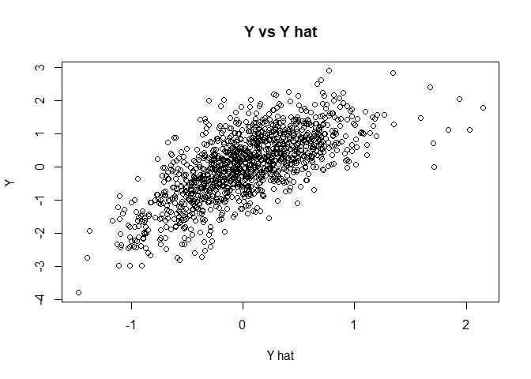<!-- -->
<br>We can see that the relation between Y and Y is linear.
Also, there is high variance in the data and some Y values do not fit to the linear line that was created by most of the data points


3.3 Submit predictions for the validation data on the 3 voxels
Save the following two objects into an Rdata file and upload into moodle:
• A 250 × 3 R matrix called preds with predictions of the mean response for the 250 validation images.
That means that column 1 row 2 should contain the prediction of the model corresponding to voxel 1
to image 2.
• A 1 × 3 vector called rmspes with your estimate of the RMSPE for each prediction model.
We will provide an example submission for you to follow.

<br>Answer<br>

```r
preds <- as.matrix(cbind(predi1,predi2,predi3))
save(preds,file="preds.Rdata")

rmspes <- as.matrix(cbind(sqrt(mean((pred_test1-Y1[testing])^2)),sqrt(mean((pred_test2-Y2[testing])^2)),sqrt(mean((pred_test3-Y3[testing])^2))))
save(rmspes,file="rmspes.Rdata")
```


