## *Lab 2: Visualization Through `ggplot`*  
<br/><br/>  
  

**Contents**:  

* [Q0. Submission Instructions](#submission-instructions)  
* [Q1. Basic Statistics (25 pt)](#basic-statistics)      
* [Q2. Scouting Report (25 pt)](#scouting-report)    
* [Q3. Model Building (30 pt)](#model-building)
* [Q4. Fix Problematic Plots (10 pt)](#fix-problematic-plots)  
* [Q5. Open Question (10 pt)](#open-question)

<br/><br/>
  
  
### Q0.Submission Instructions  
  
This lab will be submitted in pairs using GitHub (if you don't have a pair, please contact us).  
Please follow the steps in the  [GitHub-Classroom Lab 2](https://classroom.github.com/g/6_Wy5z44) to create your group's Lab 2 repository.  
**Important: your team's name must be `FamilyName1_Name1_and_FamilyName2_Name2`**.  
You can collaborate with your partner using the git environment; You can either make commits straight to master, or create individual branches (recommended). However, once done, be sure to merge your branches to master - you will be graded using the most recent *master* version - your last push and merge before the deadline.   
**Please do not open/review other peoples' repositories - we will be notified by GitHub if you do.**

Your final push should include this Rmd file (with your answers) together with the html file that is outputted automatically by knitr when you knit the Rmd. Anything else will be disregarded. In addition, please adhere to the following file format:    
`Lab_2_FamilyName1_Name1_and_FamilyName2_Name2.Rmd/html`      

Some questions may require data wrangling and manipulation which you need to decide on. <br>
In some graphs you may need to change the graph limits. If you do so, please include the outlier 
points you have removed in a separate table.

Show numbers in plots/tables using standard digits and not scientific display. That is: 90000000 and not 9e+06. <br>
Round numbers to at most 3 digits after the dot - that is, 9.456 and not 9.45581451044


The required libraries are listed below the instructions. You are allowed to add additional libraries if you want. 
If you do so, *please explain what libraries you've added, and what is each new library used for*. 

#### Background: 

You've been hired as a data analyst at the football (soccer) club Hapoel London. 
Since this is a small and under-funded club, you will not have access to real-football data, but to data from 
the football computer game fifa18. Your job is to analyze this dataset and extract meaningful insights from the data in order 
to help your club make better decisions. 

#### Data File: 
You will load and analyze the fifa18 football dataset file called "fifa_data.csv". <br> 
The dataset contains detailed information about each player in the game, including: names, age, nationality, overall ability, estimated potential ability, current club and league, market value, salary (wage), ability at different football skills (also called 'attributes', e.g. Ball.control, Sprint.speed ...), ability to play at different position in the game (CF, CM, ...) and the preferred positions of the player. 


Required Libraries:

```
## 
## Attaching package: 'dplyr'
```

```
## The following objects are masked from 'package:stats':
## 
##     filter, lag
```

```
## The following objects are masked from 'package:base':
## 
##     intersect, setdiff, setequal, union
```

```
## corrplot 0.89 loaded
```

```
## -- Attaching packages --------------------------------------- tidyverse 1.3.1 --
```

```
## v tibble  3.1.2     v stringr 1.4.0
## v readr   1.4.0     v forcats 0.5.1
## v purrr   0.3.4
```

```
## -- Conflicts ------------------------------------------ tidyverse_conflicts() --
## x readr::col_factor() masks scales::col_factor()
## x purrr::discard()    masks scales::discard()
## x dplyr::filter()     masks stats::filter()
## x dplyr::lag()        masks stats::lag()
```

```
## 
## Attaching package: 'reshape2'
```

```
## The following object is masked from 'package:tidyr':
## 
##     smiths
```

```
## Loading required package: sp
```

```
## ### Welcome to rworldmap ###
```

```
## For a short introduction type : 	 vignette('rworldmap')
```

<br/><br/>

## Q1. Basic Statistics (25 pt)         

First, you are requested to load the fifa18 dataset and find and display general information about the players. 

a. Make a plot showing the age distribution of all players.
b. Make a plot comparing the *overall* ability of players in different leagues ('League'). Describe which leagues have especially good/bad players.
c. Make a plot showing the density of players' salary ('Wage') distribution. <br>
Next, make a separate plot showing the density distribution of the *log* of players' salary. <br>
Which of the two visualizations is better? how skewed are the distributions? do they have fat tails? which is better described by a Normal distribution? explain. 
d. Are the top-10 players with the highest value also the top-10 best players in terms of *overall* ability? 
Show tables for both and compare. <br> Who is the best player not in the top-10 valued players? 
e. Show a table of the ten *best* and ten *worst* teams in terms of *average* player overall ability. 


Loading the data:

```r
fifa_players <- data.frame(read.csv(url("https://raw.githubusercontent.com/DataScienceHU/DataAnalysisR_2020/master/data/fifa_data.csv")))
# Pre-processing: 
for (i in c(3,6,7,10:71)) {
  fifa_players[,i]<-as.numeric((fifa_players[,i]))
}
fifa<-na.omit(fifa_players)
fifa_players<-fifa
fifa_players_info<-fifa[,c(1:11)] # players general info 
fifa_players_attribures<-fifa[,c(1,12:45, 6)] # players different skills. Add overall
fifa_players_positions<-fifa[,c(1,46:72,6)] # players ability at different positions . Add overall 
```

**a)**

```r
fifa_players %>% ggplot(aes(Age)) + geom_histogram(stat="count",color = "black", fill = "blue", bins = 33) + coord_cartesian(ylim = c(0,1500)) + scale_x_continuous(breaks = seq(16, 47, 5)) +labs(title = " Age distribution of all players")
```

```
## Warning: Ignoring unknown parameters: binwidth, bins, pad
```

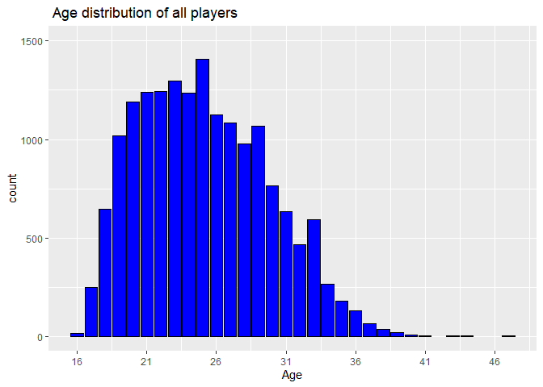<!-- -->

**b)**

```r
fifa_players %>% ggplot(aes(x = League, y = Overall,fill=League)) + geom_boxplot() + theme(axis.text.x=element_blank()) + scale_fill_discrete(name="League",labels =c("Belgium Jupiler League","England Premier League","France Ligue 1"," Germany Bundesliga"," Italy Serie A ","Netherlands Eredivisie","other","Poland Ekstraklasa","Portugal Liga ZON Sagres","Scotland Premier League","Spain LIGA BBVA","Switzerland Super League") ) + labs(title = "Overall ability of players in different leagues")
```

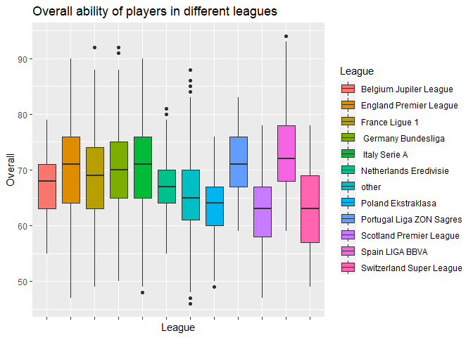<!-- -->
<br>**Answer**<br>

It seems that Spain LIGA BBVA have especially good as we can see that their Q.75 is high compared to the other leagues. <br>
Also we can see that the Switzerland Super League have especially bad players because,their Q.25 is low compared to the other leagues.


**c)**


```r
library(e1071)
fifa_players %>% ggplot(aes(Wage)) + geom_density(fill="red") + scale_y_continuous(name="density", labels = comma) + scale_x_continuous(name="Wage", labels = comma) + labs(title = "density of players' salary")
```

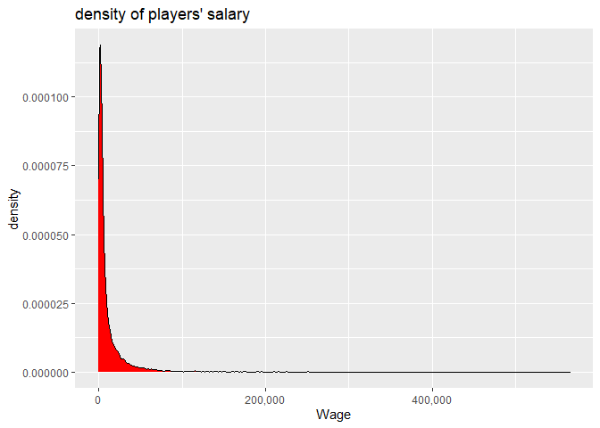<!-- -->

```r
round(skewness(fifa_players$Wage),3)
```

```
## [1] 7.016
```

```r
round(kurtosis(fifa_players$Wage),3)
```

```
## [1] 88.322
```

```r
fifa_players %>% ggplot(aes(sample = Wage)) + stat_qq() + labs(title = "qq plot of wage density") + stat_qq_line(color="red")
```

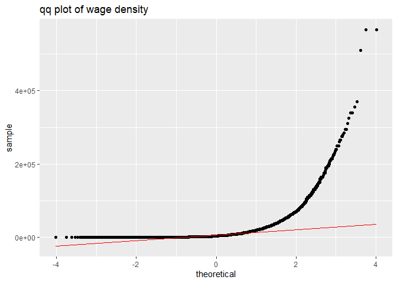<!-- -->

```r
fifa_players_info %>% mutate(log_wage = ifelse(Wage==0,0,log(Wage))) %>% ggplot(aes(log_wage)) + geom_density(fill = "darkorange2") + labs(x="log wage",title = "density of players' salary log scale") 
```

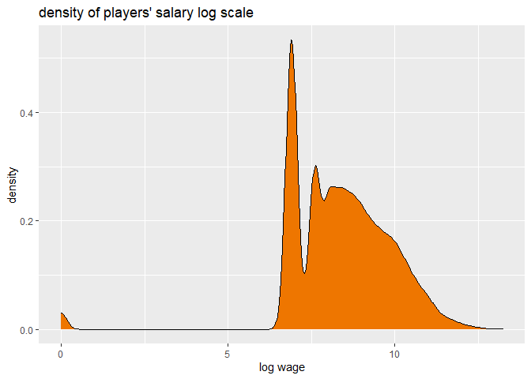<!-- -->

```r
round(skewness(ifelse(fifa_players$Wage==0,0,log(fifa_players$Wage))),3)
```

```
## [1] -1.503
```

```r
round(kurtosis(ifelse(fifa_players$Wage==0,0,log(fifa_players$Wage)),3))
```

```
## [1] 8
```

```r
fifa_players %>% ggplot(aes(sample =ifelse(Wage==0,0,log(Wage)))) + stat_qq() + stat_qq_line(color="red") + labs(title = "qq plot of wage density log scale" )
```

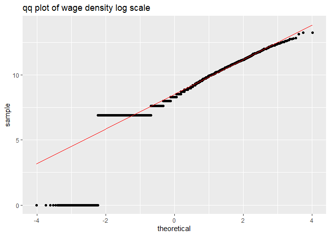<!-- -->
<br>**Answer**<br>

The logarithm scale of the wage density is a better visualization of than the <br> 
non logarithm scale because it lets the viewer the density of players who make a high salary next to the players who make a low one. <br> 
Unlike the non logarithm plot that show mostly the players who make low salary. <br>

The skewness & kurtosis of the  wage distribution are 7.016 and 88.322.<br>
the skewness & kurtosis of the log wage distribution are -1.503 and 7.967.<br>

Because the wage distribution has a skewness of 7.016 it means that this <br> distribution has a "fat tail" on the positive side of the x axis.<br>
Also, because the log wage distribution has a skewness of -1.503 that this <br> distribution has a "fat tail" on the negative side of the x axis.<br>

The log wage distribution is described by a Normal distribution from two reasons.<br>
1) the the skewness & kurtosis of the log wage are closer to the one of a normal distribution(the skewness & kurtosis of the normal distribution are 0 ).<br>
2) as we can see from the qq-plots about half of the data is fitted as we will<br>expect from a normal distribution(unlike the wage distribution who has a very "fat" tail). 


<br>**d)**<br>

```r
top_valued <-fifa_players_info  %>% select(Name,Value,Overall) %>%  arrange(desc(Value))
top_valued$Value <- as.integer(top_valued$Value)

top_overall <-fifa_players_info  %>% select(Name,Value,Overall) %>%  arrange(desc(Overall))
top_overall$Value <- as.integer(top_overall$Value)
head(top_valued,10)
```

```
##                 Name     Value Overall
## 1             Neymar 123000000      92
## 2           L. Messi 105000000      93
## 3         L. Su\303¡rez  97000000      92
## 4  Cristiano Ronaldo  95500000      94
## 5     R. Lewandowski  92000000      91
## 6          E. Hazard  90500000      90
## 7       K. De Bruyne  83000000      89
## 8          P. Dybala  79000000      88
## 9           T. Kroos  79000000      90
## 10       G. Higua\303­n  77000000      90
```

```r
head(top_overall,10)
```

```
##                 Name     Value Overall
## 1  Cristiano Ronaldo  95500000      94
## 2           L. Messi 105000000      93
## 3             Neymar 123000000      92
## 4           M. Neuer  61000000      92
## 5         L. Su\303¡rez  97000000      92
## 6     R. Lewandowski  92000000      91
## 7          E. Hazard  90500000      90
## 8             De Gea  64500000      90
## 9        G. Higua\303­n  77000000      90
## 10          T. Kroos  79000000      90
```

```r
z<-top_overall %>% filter(Value<=top_valued$Value[10])
z[1,]
```

```
##       Name    Value Overall
## 1 M. Neuer 61000000      92
```

<br>**Answer**<br>
The best player not in the top-10 valued players is M.Neuer

**e)**

```r
top_teams <- fifa_players_info %>% group_by(Club) %>% summarise(Overall_avg = mean(Overall)) %>% arrange(desc(Overall_avg))
worst_teams <- fifa_players_info %>% group_by(Club) %>% summarise(Overall_avg = mean(Overall)) %>% arrange(Overall_avg)
top_ten_teams<-head(top_teams,10)
worst_ten_teams<-head(worst_teams,10)
worst_ten_teams$Overall_avg <- round(worst_ten_teams$Overall_avg,3)
combo <- cbind(top_ten_teams,worst_ten_teams)
names(combo)<-c("top","overall","worst","overall")
combo$overall<-round(combo$overall,3)
combo
```

```
##                    top overall           worst overall
## 1         FC Barcelona  82.560   Galway United  54.125
## 2             Juventus  81.520 Drogheda United  54.760
## 3       Real Madrid CF  81.038      Finn Harps  55.000
## 4     FC Bayern Munich  80.160     Limerick FC  55.524
## 5  Paris Saint-Germain  77.964     Bohemian FC  55.800
## 6               Napoli  77.600    Sligo Rovers  56.087
## 7    Manchester United  77.545  Bray Wanderers  56.238
## 8                 Roma  77.040 Crewe Alexandra  56.308
## 9           Sevilla FC  76.962   FC Helsing\303¸r  56.593
## 10               Inter  76.720      Derry City  56.765
```


PLEASE ADD YOUR SOLUTION BELOW, WITH A CLEAR SEPARATION BETWEEN THE PARTS!

## Q2. Scouting Report (25 pt)

You are in charge of the scouting division. The goal of this division is to follow players' potential and overall ability, and identify undervalued players - that is, players whose current value is lower compared to what would be expected based on their predicted future ability. 

a. Your boss wants to fly abroad to recruit promising players. Use the *rworldmap* package to display the world map and color each country based on the *total number of players* from this nationality. 

b. Quantity may not guarantee quality. Repeat the above analysis but this time display a world map where each country is colored by the *average overall quality* of players. Find an under-represented country you'd recommend to travel to (i.e. a country with few players with high overall average quality). 

c. Show the *average overall* ability by *age* of all players, for players 35 years old or younger

d. Make a graph showing the *average difference* between a player's overall ability to potential ability as a function of age, up to age 35. At what ages should we expect to find players for future development based on this graph?  

e. We are seeking young (age <=21) players with high Overall ability (>70). Show a scatter plot of these players comparing their *Potential* ability (y-axis) and current salary (*Wage*, x-axis). 
Prepare a table showing the 10 most-undervalued players, i.e. currently lowest payed compared to their potential. Calculate for each of them what is a fair salary matching their potential that you would offer to lure them away from their current club and show it in the table.


PLEASE ADD YOUR SOLUTION BELOW, WITH A CLEAR SEPARATION BETWEEN THE PARTS!
<br>**a)**<br>

```r
nati <- as.vector(fifa_players$Nationality)
nati[which(nati=="England"|nati=="Wales"|nati=="Scotland"|nati=="Northern Ireland")]<- "United Kingdom"
nati[which(nati=="Republic of Ireland")]<-"Ireland"
nati[which(nati=="Czech Republic")] <- "Czech Rep."
natinal <- table(nati)
natinal <- as.data.frame(natinal)
colnames(natinal)[1]<- "Country"
jj <- joinCountryData2Map(natinal,nameJoinColumn = "Country",joinCode = "NAME")
```

```
## 134 codes from your data successfully matched countries in the map
## 1 codes from your data failed to match with a country code in the map
## 109 codes from the map weren't represented in your data
```

```r
mapCountryData(jj,"Freq",mapTitle = "Number of players in each country",lwd = 1.3,catMethod=c(seq(0,2100,150)))
```

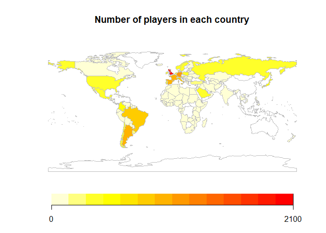<!-- -->


**b)**

```r
map_over <- fifa_players %>% group_by(Nationality) %>%  summarise(Overall_avg=mean(Overall))
map_over<-as.matrix(map_over)
uk <- c("United Kingdom",63.3935)
ireland <-c("Ireland",60.07434)
cecz<-c("Czech Rep.",70.17808)
map_over<-rbind(map_over,uk,ireland,cecz)
map_over<-as.data.frame(map_over)
colnames(map_over)[1] <- "Country"
map_over$Overall_avg<-as.numeric(as.character(map_over$Overall_avg))
jj2<-joinCountryData2Map(map_over,nameJoinColumn = "Country","NAME")
```

```
## 135 codes from your data successfully matched countries in the map
## 5 codes from your data failed to match with a country code in the map
## 108 codes from the map weren't represented in your data
```

```r
mapCountryData(jj2,nameColumnToPlot = "Overall_avg",catMethod=c(seq(50,75,5)),mapTitle = "Overall average of players in each country")
```

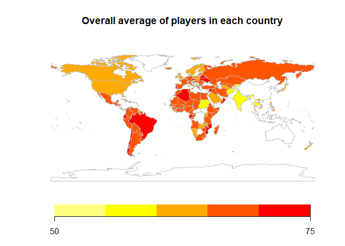<!-- -->

<br>**Answer**<br>
We will recommend to travel to Algeria that has 57 players and have a Overall average of 70.94737


**c)**

```r
fifa_players_info %>% filter(Age<=35) %>%  group_by(Age) %>% summarise(Overll_avg = mean(Overall)) %>% ggplot(aes(x=Age,y=Overll_avg,)) + geom_bar(stat = "identity",fill="green",color="black",width = 0.7 ,position = position_dodge(width=0.5),lwd=1) + coord_cartesian(ylim = c(0,70),xlim = c(16,35))  + scale_y_continuous(breaks = seq(0, 70, 10)) + scale_x_continuous(breaks = seq(16, 35,1)) + labs(title = "Overall average abilty distribution in age",y="Overall average")
```

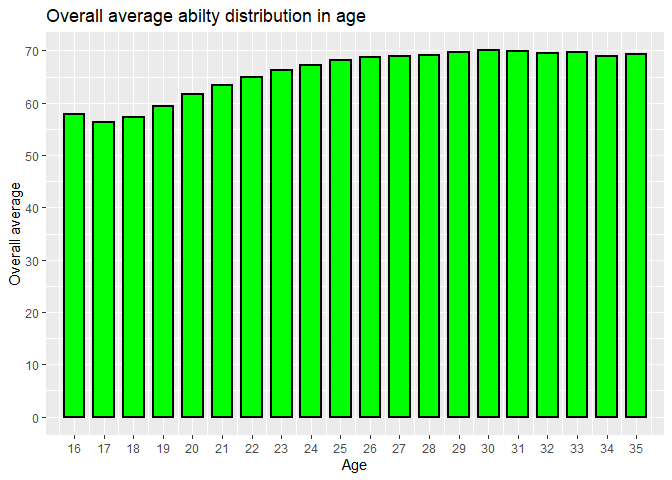<!-- -->

<br>**d)**<br>

```r
players_under_35 <- fifa_players_info %>% filter(Age<=35) %>% select(Name,Age,Overall,Potential) %>% mutate(difference = Potential - Overall)

players_under_35 %>% group_by(Age) %>% summarise(difference_avg = mean(difference)) %>% ggplot(aes(x=Age,y=difference_avg)) + geom_line(color="red",lwd =1.5) + coord_cartesian(ylim = c(0,20),xlim = c(16,35))  + scale_x_continuous(breaks = seq(16, 35,1)) + theme_bw() + labs(title = " average difference by age",y="difference average")
```

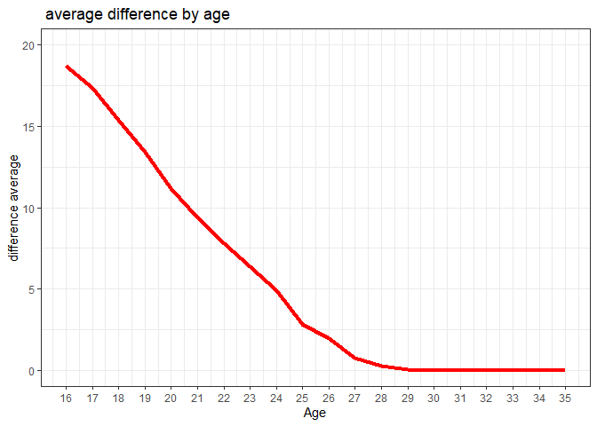<!-- -->
<br>**Answer**<br>
We should expect to find players for future development based on this graph<br>
on the ages of 16/17, because those are the ages that have the most "space" for<br> future development between their Overall ability and their Potential.  
<br>**e)**<br>


```r
fifa_players_info %>% filter(Age<=21,Overall>70) %>% ggplot(aes(x=Wage,y=Potential)) + geom_point() + coord_cartesian(ylim = c(75,95),xlim = c(0,200000)) +labs(title = "Potential as a function of wage")
```

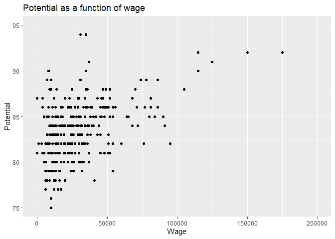<!-- -->

```r
undervalued_players <- fifa_players_info %>% filter(Age<=21,Overall>70) %>%  arrange(Wage,desc(Potential)) %>% select(Name,Age,Nationality,Overall,Potential,Wage)


result <- fifa_players_info %>% select(Potential,Wage) %>% group_by(Potential) %>% summarise(wage_avg <-ceiling(mean(Wage)))
colnames(result)[2]<- "fair salary offer"
under_all <- left_join(result,undervalued_players,by="Potential")
under_all <- na.omit(under_all)
under_all$`fair salary offer`<- round(under_all$`fair salary offer`,-3)
under_all %>% select(Name,Potential,Wage,`fair salary offer`) %>% arrange(Wage,desc(Potential)) %>% head(10)  %>%  arrange(desc(`fair salary offer`))
```

```
## # A tibble: 10 x 4
##    Name         Potential  Wage `fair salary offer`
##    <fct>            <dbl> <dbl>               <dbl>
##  1 W. Farֳ­ֳ±ez           87     0               94000
##  2 Aleֳ±ֳ                87  4000               94000
##  3 Vitinho             86  4000               71000
##  4 Jorge Sֳ¡enz         85  5000               54000
##  5 V. Kovalenko        82  1000               35000
##  6 J. Barrera          82  3000               35000
##  7 R. Coetzee          81     0               32000
##  8 G. Troupֳ©e         81  4000               32000
##  9 Cotֳ¡n               81  5000               32000
## 10 K. Acosta           80  5000               28000
```
<br>**Answer**<br>

We calculated the fair offer by taking the average of all the players<br>
with the same Potential as the undervalued players.<br>
therefore paying a player the average salary that match his ability.


## Q3. Model Building (30 pt)
In this question we try to find specific skills which can *predict* the overall players' quality. 
We will also build graphs which will help us compare different skills.

a. We are interested in finding out which skills are similar in terms of players' performance at the position. 
Extract the 29 skills for non-goalkeeper players (Acceleration, ..., Volleys, except 'GK.*' skills). 
Calculate the correlation between players' ability in each pair of skills and show a heatmap correlation-plot of the correlations' matrix. What two skills seem least correlated with other skills? 
b. Consider the following six major players positions: CAM, CB, CM, RB, RW, ST and in addition the Overall players' performance. Show a correlation-plot of players' skill levels vs. their performance at the six positions + Overall performance. Find the 7 skills mostly correlated for player's Overall performance and list them in a table.
c. Build your team by selecting six *different* players, one in each of the above positions in such a way that the players chosen are the best in their individual position. If the same player is the best at multiple positions, try to build the team in such a way that maximize the team's overall average score. Using the function `radarchart::chartJSRadar`,graph their abilities (individually for all 6 player) in a spider (radarchart) graph. See below an example for such a chart. What is your team's overall average score?
[radar chart](https://en.wikipedia.org/wiki/Radar_chart) (also called 'spider chart')  
d. We are interested in determining how each of the different player's abilities changes with age. 
Repeat the analysis of question 2.c., but this time show the different skills separately. 
Which skills peak at youngest/oldest ages?
e. Your boss suggests that some players may be currently under-performing compared to their skill levels (possibly due to poor fit with their current Club, recent injuries, bad luck, psychological or other reasons), 
and that acquiring them may be beneficial as they will be expected to perform better in the future. 
Fit a multiple regression model predicting player's Overall performance based on their skill level at the 29 different skills. Find the $10$ players with the least Overall performance level compared to what would their set of skills predict, 
and list them in a table. 


PLEASE ADD YOUR SOLUTION BELOW, WITH A CLEAR SEPARATION BETWEEN THE PARTS! 

**a)**

```r
library(ggcorrplot)
attri <- fifa_players_attribures %>% select(-GK.diving,-GK.handling,-GK.kicking,-GK.positioning,-GK.reflexes,-ID,-Overall) %>% cor() %>% round(2)

melt_attri <- melt(attri)
colnames(melt_attri)[3] <- "correlation"
melt_attri %>% ggplot(aes(x=Var1,Var2,fill=correlation)) + geom_tile() + scale_fill_gradient(low="blue", high="red") + 
  theme_bw() +  theme(axis.text.x = element_text(angle = 45, hjust = 1)) + labs(title = "correlation betweem diffrent abilitys",x="",y="") 
```

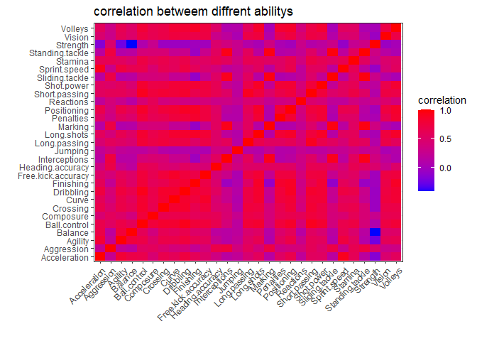<!-- -->
<br>**Answer**<br>
two skills seem least correlated with other skills are strength and jumping.

**b)**

```r
library(ggcorrplot)
pos <- fifa_players_positions %>% select(ID,CAM, CB, CM, RB, RW, ST,Overall)
attri <- attri <- fifa_players_attribures %>% select(-GK.diving,-GK.handling,-GK.kicking,-GK.positioning,-GK.reflexes,-Overall)
pos_attri <- left_join(pos,attri,by="ID")
pos_attri <- pos_attri %>% select(-ID)
attri <- attri %>% select(-ID)
cor_pos_attri<-round(cor(pos_attri),2)
cor_pos_attri <- cor_pos_attri[c(8:36),c(1:7)]

cor_pos_attri %>% ggcorrplot() + scale_x_discrete(limit = colnames(attri)) + labs(title = "correlation between chosen positions and Overall and players skils") + theme(title = element_text(color="black",size=8,face="bold"),axis.ticks = element_line(),axis.text.x = element_text(hjust = 1,angle = 90,vjust = 0.5))
```

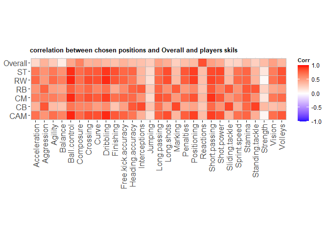<!-- -->

```r
p <-as.data.frame(cor_pos_attri[,7])
colnames(p)[1] <- "Overall"
p <- cbind(row.names(p),p$Overall)
p <-as.data.frame(p)
colnames(p)<- c("skills","correlation_with_overall")
p %>% arrange(desc(correlation_with_overall)) %>% head(7)
```

```
##          skills correlation_with_overall
## 1     Reactions                     0.84
## 2     Composure                     0.63
## 3 Short.passing                     0.49
## 4        Vision                     0.49
## 5  Long.passing                     0.48
## 6  Ball.control                     0.46
## 7    Shot.power                     0.43
```

**c)**

```r
library(fmsb)
name_of_playres <- fifa_players_info %>% select(Name,ID)
new_poss <- right_join(name_of_playres,pos,by="ID") %>% select(-ID,-Overall)
best_CAM <- new_poss %>% arrange(desc(CAM))
best_CAM <- as.numeric(as.matrix(best_CAM[1,]))
```

```
## Warning: NAs introduced by coercion
```

```r
best_CB <-  new_poss  %>% arrange(desc(CB))
best_CB <-  as.numeric(as.matrix(best_CB[1,]))
```

```
## Warning: NAs introduced by coercion
```

```r
best_CM <-new_poss%>% arrange(desc(CM))
best_CM <-  as.numeric(as.matrix(best_CM[1,]))
```

```
## Warning: NAs introduced by coercion
```

```r
best_RB <-new_poss %>% arrange(desc(RB))
best_RB <-  as.numeric(as.matrix(best_RB[4,])) 
```

```
## Warning: NAs introduced by coercion
```

```r
best_RW <-new_poss  %>% arrange(desc(RW))
best_RW <- as.numeric(as.matrix(best_RW[3,]))
```

```
## Warning: NAs introduced by coercion
```

```r
best_ST <- new_poss  %>% arrange(desc(ST))
best_ST <- as.numeric(as.matrix(best_ST[1,]))
```

```
## Warning: NAs introduced by coercion
```

```r
attri_name <- left_join(name_of_playres,fifa_players_attribures,by="ID") %>% select(-GK.diving,-GK.handling,-GK.kicking,-GK.positioning,-GK.reflexes,-ID) %>% filter(Name %in% c("L. Messi" , "Sergio Ramos" , "T. Kroos" , "Marcelo", "Neymar" , "Cristiano Ronaldo" ),Overall>80) %>% select(-Overall)

best_team <- as.data.frame(rbind(rep(100,6),rep(0,6),attri_name))
```

```
## Warning in `[<-.factor`(`*tmp*`, ri, value = 100): invalid factor level, NA
## generated
```

```
## Warning in `[<-.factor`(`*tmp*`, ri, value = 0): invalid factor level, NA
## generated
```

```r
rownames(best_team) <- c("max","min","Neymar" , "L. Messi","Cristiano Ronaldo", "T. Kroos","Sergio Ramos", "Marcelo" )
best_team <- best_team %>% select(-Name)

radarchart(best_team,seg = 5,plwd = 4,axistype = 2,plty = 1,palcex = 1,vlcex = 0.8,pcol = c("red",
"deeppink","dodgerblue4","gold","burlywood4","green4"),title = "DREAM TEAM",cex.main = 2,centerzero = T)

legend("top",legend = rownames(best_team)[3:8],horiz = T, pch= 16 , text.col = "black",col =c("red",
"deeppink","dodgerblue4","gold","burlywood4","green4") , cex=0.6, pt.cex=1.5)
```

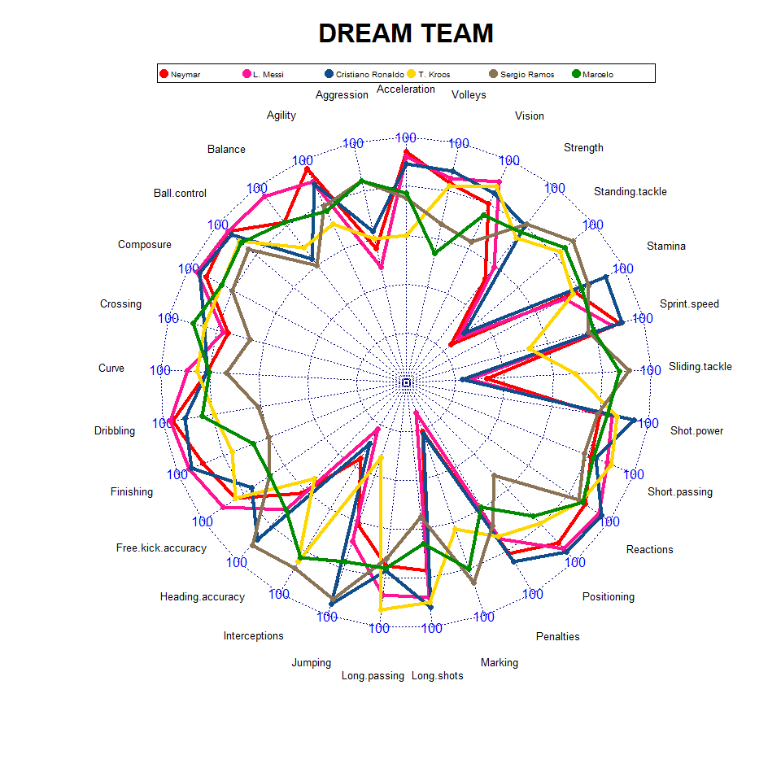<!-- -->

```r
right_join(name_of_playres,pos,by="ID") %>% select(-ID,Overall) %>% filter(Name %in% c("L. Messi","Sergio Ramos","T. Kroos","Marcelo","Neymar", "Cristiano Ronaldo"),Overall>=80) %>% select(Overall) %>% summarise(Overall=mean(Overall))
```

```
##   Overall
## 1      91
```

**d)**

```r
id_age <- fifa_players %>% select(Age,ID)
skill <- fifa_players_attribures %>% select(-GK.diving,-GK.handling,-GK.kicking,-GK.positioning,-GK.reflexes,-Overall)
q<-left_join(id_age,skill,by = "ID") %>% select(-ID) %>% group_by(Age) %>% summarise_all(list(mean)) %>% filter(Age<=35) %>% melt(id="Age")
colnames(q)[2:3] <- c("skill","ability")

q %>%  ggplot(aes(x=Age,y=ability)) + geom_line(lwd=2,color="red") + coord_cartesian(ylim = c(30,70),xlim = c(15,35)) +theme_bw() + labs(title = "players skill as a function of time") + facet_wrap(~q$skill) + theme(axis.title.x =element_text(color="black",size=15,face="bold"),axis.text.x =element_text(color="black",size=12,face="bold"),axis.text.y =element_text(color="black",size=15,face="bold"),axis.title.y = element_text(color="black",size=15,face="bold"),title = element_text(color="black",size=15,face="bold"))  
```

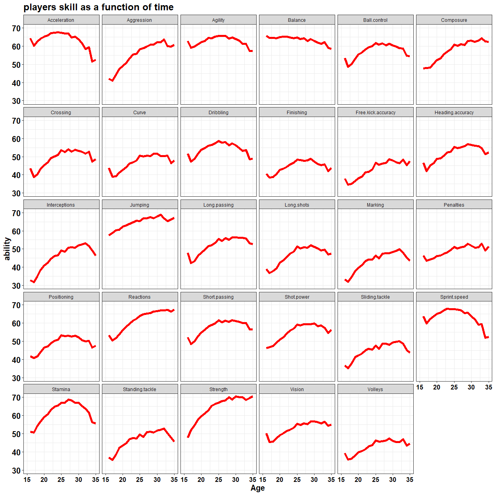<!-- -->
<br>**Answer**<br>

The skils that peak at youngest ages are mostly the skils related to physical<br>
abilities such as stamina,sprint speed, acceleration and more.
and the skils that peak at old ages are the ones related to playing abilities that come with experience <br>such as vision,reactions, free kick and head <br> accuracy and more.

**e)**

```r
ski <- fifa_players_attribures %>% select(-GK.diving,-GK.handling,-GK.kicking,-GK.positioning,-GK.reflexes,)
ski <- left_join(name_of_playres,ski,by="ID")
model<-lm(Overall ~. -ID -Name,data=ski)
summary(model)
```

```
## 
## Call:
## lm(formula = Overall ~ . - ID - Name, data = ski)
## 
## Residuals:
##      Min       1Q   Median       3Q      Max 
## -14.4085  -2.1625   0.0305   2.1965  14.6689 
## 
## Coefficients:
##                      Estimate Std. Error t value Pr(>|t|)    
## (Intercept)        22.2428412  0.3024525  73.542  < 2e-16 ***
## Acceleration        0.0156338  0.0049731   3.144  0.00167 ** 
## Aggression         -0.0115490  0.0028139  -4.104 4.07e-05 ***
## Agility            -0.0054293  0.0037917  -1.432  0.15219    
## Balance            -0.0485756  0.0034294 -14.165  < 2e-16 ***
## Ball.control        0.0689114  0.0061876  11.137  < 2e-16 ***
## Composure           0.1006123  0.0037849  26.582  < 2e-16 ***
## Crossing            0.0338512  0.0034252   9.883  < 2e-16 ***
## Curve               0.0090329  0.0036484   2.476  0.01330 *  
## Dribbling          -0.0385246  0.0051565  -7.471 8.34e-14 ***
## Finishing           0.0134613  0.0042588   3.161  0.00158 ** 
## Free.kick.accuracy -0.0005552  0.0032641  -0.170  0.86493    
## Heading.accuracy   -0.0256437  0.0032224  -7.958 1.86e-15 ***
## Interceptions       0.0031238  0.0040355   0.774  0.43889    
## Jumping             0.0395008  0.0026784  14.748  < 2e-16 ***
## Long.passing        0.0059374  0.0044578   1.332  0.18290    
## Long.shots         -0.0016797  0.0039627  -0.424  0.67166    
## Marking            -0.0007445  0.0050999  -0.146  0.88393    
## Penalties          -0.0160728  0.0035038  -4.587 4.52e-06 ***
## Positioning        -0.0847956  0.0039839 -21.285  < 2e-16 ***
## Reactions           0.5031254  0.0038854 129.491  < 2e-16 ***
## Short.passing       0.0436415  0.0059822   7.295 3.11e-13 ***
## Shot.power          0.0072075  0.0037126   1.941  0.05223 .  
## Sliding.tackle     -0.0273641  0.0058804  -4.653 3.29e-06 ***
## Sprint.speed        0.0338613  0.0046697   7.251 4.31e-13 ***
## Stamina            -0.0196674  0.0031015  -6.341 2.34e-10 ***
## Standing.tackle     0.0010313  0.0060386   0.171  0.86439    
## Strength            0.0653707  0.0032036  20.405  < 2e-16 ***
## Vision              0.0406676  0.0035582  11.429  < 2e-16 ***
## Volleys            -0.0028175  0.0037173  -0.758  0.44850    
## ---
## Signif. codes:  0 '***' 0.001 '**' 0.01 '*' 0.05 '.' 0.1 ' ' 1
## 
## Residual standard error: 3.372 on 17077 degrees of freedom
## Multiple R-squared:  0.7722,	Adjusted R-squared:  0.7718 
## F-statistic:  1996 on 29 and 17077 DF,  p-value: < 2.2e-16
```

```r
ski <-cbind(ski,model$fitted.values)
colnames(ski)[33] <- "fitted values"
ski <- ski %>% mutate(diff= round(Overall -`fitted values`,3)) # computing the eror manualy
ski %>% select(Name,Overall,`fitted values`,diff) %>% arrange(diff) %>%  head(10)
```

```
##               Name Overall fitted values    diff
## 17003  A. Maccoppi      54      68.40850 -14.409
## 8473    Y. Maouche      53      67.19906 -14.199
## 15652   M. G\303³rski      59      72.35440 -13.354
## 10327    O. Tejeda      56      68.82942 -12.829
## 11604 L. McCormick      67      79.69209 -12.692
## 11266       T. Oya      54      66.55723 -12.557
## 9310     O. Jallow      64      76.46519 -12.465
## 13595         Jano      66      78.41930 -12.419
## 8082      R. Olsen      59      71.20252 -12.203
## 13061     D. Coyne      55      66.92476 -11.925
```


## Q4. Fix Problematic Plots (10 pt)

The previous data-analyst of the club was fired for producing poor plots. 
Below see a code for two bar plots that he made.

a. Describe in your own words what did your predecessor try to show in each of the two plots. 
b. Find *at least* three problematic issues with his plot, and explain them. 
c. Fix the problematic issues above in the code below to generate new, improved plots. 
You will get an additional *bonus* point for finding any additional problem and fixing it.  

<br>**Answers**<br>

**a)**<br>
On the first plot my predecessor tried to show the top 10 football clubs in<br>
terms of number of different nationalities of the club's players<br>

On the second plot the predecessor tried to show the diversity of players<br> nationalities measured by Simpson's Diversity Index.<br>

<br>**b)**<br>

1) there are bars with missing lengeds(without them we can not match the<br>data to variable)<br>
2) axies with unclear labels(the observer can not match the height of the bar<br> with the variable that the bar measures and scale of measurement).<br>
3) there are no titles<br>(for example even if we knew that DIV stand for<br> diversity, the observer needs to know the scales units(like meters or inches if<br> we measure height))<br>
4)the colors of the bars are confusing to the observer(by coloring only the<br> outside of the bar, all the bars looks the same)


```r
# A measure of category's diversity
DIV <- function(category_vec){
  t <- table(category_vec)
  p <- t/sum(t)
  return (sum(p^2))
}

cleaned_data <- fifa_players %>% select(Nationality,Club) %>% filter(Club != "")

number_of_nationality_in_club <- cleaned_data %>% group_by(Club,Nationality) %>% summarise(count = n()) %>% group_by(Club) %>% summarise(N_nation=n()) %>% arrange(desc(N_nation)) %>% mutate(Club = factor(Club,level=unique(Club)))
```

```
## `summarise()` has grouped output by 'Club'. You can override using the `.groups` argument.
```

```r
DIV_in_club <- cleaned_data %>% group_by(Club) %>% summarise(DIV = DIV(Nationality))%>% arrange(DIV)%>% mutate(Club = factor(Club,level=unique(Club)))  # arrange(desc(DIV)) %>% 

# Plot number of different nationalities in each club
g <- ggplot(data = number_of_nationality_in_club %>% head(10),aes(x = Club,y = N_nation,fill= Club)) 
g + geom_bar(stat="identity",color="black",width = 0.5) + theme(axis.text.x =element_blank(),axis.ticks.x = element_blank()) +labs(x="",y="Number of nationalities",title = "Clubs with the most nationalities of players") + coord_cartesian(ylim = c(0,20))
```

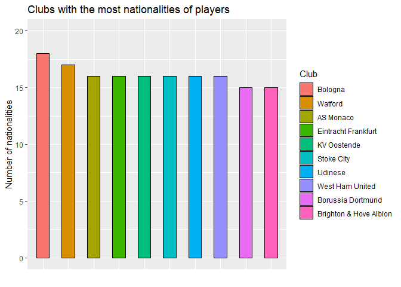<!-- -->

```r
# Plot DIV (diversity?) of different nationalities in each club
g <- ggplot(data = DIV_in_club %>% head(10),aes(x = Club,y = DIV, fill = Club))
g <- g + geom_bar(stat="identity",color="black",width = 0.5) + theme(axis.text.x =element_blank(),axis.ticks.x = element_blank()) + labs(x="",y="diversity",title ="diversity by Simpson's Diversity Index" ) + coord_cartesian(ylim = c(0,0.15))
g
```

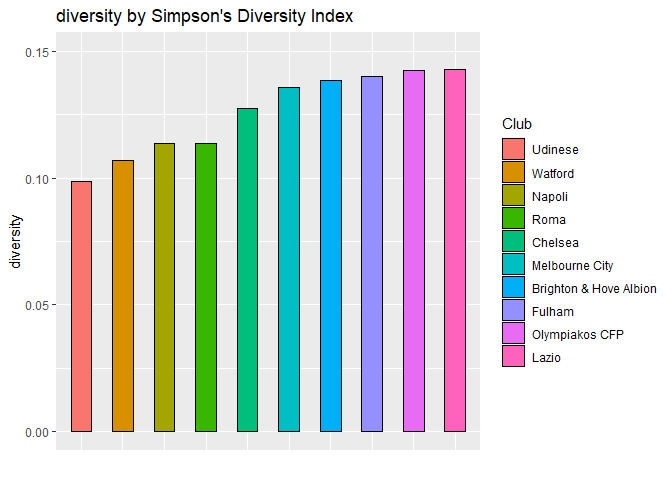<!-- -->
<br>**Answer**<br>

**a)**<br>


PLEASE ADD YOUR SOLUTION BELOW, WITH A CLEAR SEPARATION BETWEEN THE PARTS! 


## Q5. Back to the real world (10 pt)

Your boss is not convinced that your analysis of the fifa18 dataset is relevant for performance in the real world. To convince her, you need to show her that the fifa18 data can predict actual performance in football. Load the fifa ranking dataset ['fifa_ranking.csv'](https://raw.githubusercontent.com/DataScienceHU/DataAnalysisR_2020/master/data/fifa_ranking.csv) which contains ranking of countries based on their actual performance in international football competitions. 
Use the fifa18 dataset to compare the real vs. game football levels across all countries. 
What is your conclusion regarding the relevancy of the fifa18 game dataset to the real world?
Use your best judgment to choose the appropriate data, models, analysis and plots to support your conclusions. 


```r
fifa_ranking <- read.csv(url('https://raw.githubusercontent.com/DataScienceHU/DataAnalysisR_2020/master/data/fifa_ranking.csv'))

fifa_rank <- fifa_ranking %>% filter(rank_date %in% c("2018-06-07","2018-05-17","2018-04-12","2018-03-15","2018-02-15","2018-01-18")) %>% select(rank,country_full,rank_date)

top10_2018_jun <- fifa_rank %>% filter(rank_date == "2018-06-07") %>% head(50)
top10_2018_may <- fifa_rank %>% filter(rank_date == "2018-05-17") %>% head(50)
top10_2018_april <- fifa_rank %>% filter(rank_date == "2018-04-12") %>% head(50)
top10_2018_march <- fifa_rank %>% filter(rank_date == "2018-03-15") %>% head(50)
top10_2018_fab <- fifa_rank %>% filter(rank_date == "2018-02-15") %>% head(50)
top10_2018_jan <- fifa_rank %>% filter(rank_date == "2018-01-18") %>% head(50)

all<-rbind(top10_2018_jun,top10_2018_may,top10_2018_april,top10_2018_march,top10_2018_fab,top10_2018_jan)
colnames(all)[2]<- "Nationality"

uni_cont <-as.data.frame(unique(all$Nationality))
ower_count <- fifa_players_info %>% filter(Overall >= 80) %>% group_by(Nationality) %>% summarise(count = n()) %>% arrange(desc(count)) %>% head(50) %>%  select(Nationality)
colnames(uni_cont)[1] <- "Nationality"

not_join <- anti_join(uni_cont,ower_count,by="Nationality")
not_join
```

```
##               Nationality
## 1                    Peru
## 2                 Tunisia
## 3                     USA
## 4        Northern Ireland
## 5                 Romania
## 6                Paraguay
## 7               Venezuela
## 8                  Serbia
## 9               Australia
## 10                IR Iran
## 11               Congo DR
## 12 Bosnia and Herzegovina
## 13               Scotland
## 14               Bulgaria
## 15                Hungary
## 16                Jamaica
## 17                Bolivia
## 18           Burkina Faso
```
<br>**Answer**<br>

Our assumptions of the model is that countries with the most players with Overall<br> abilities that over 80 can be seen in the top 50 football national teams.<br>

After calculating all the teams that were on the top 50 football national teams <br>
in the year 2018, we found out that there were 55 unique teams that were<br>
at some point at the top 50 football national teams. <br>
after we compared the list of top 50 national teams with Overall abilities that<br> over 80 with the 55 unique teams on fifa's rank <br>
we found out that 18 of them dont match our list of 50 teams. <br>
it means that about 13 teams that appear on fifa's rank  <br>
do not appear on ours. <br>
It makes us assume there no strong relations between the number of players <br> with overall over 80 in each country to fifa's rank.<br> 

Let's try another approach. <br>


```r
country_id <- fifa_players_info %>% select(Nationality,ID)
country_score <- fifa_ranking %>% filter(rank_date %in% c("2018-06-07","2018-05-17","2018-04-12","2018-03-15","2018-02-15","2018-01-18")) %>% select(total_points,country_full) %>% group_by(country_full) %>% summarise(avg_total=mean(total_points))


new_attri <- left_join(country_id,fifa_players_attribures,by="ID") 
new_attri <- new_attri %>% select(-ID) %>% filter(Overall>=80) %>%   group_by(Nationality) %>% summarise_all(list(avg = mean))
colnames(country_score)[1]<- "Nationality" 
lm_table <- right_join(country_score,new_attri,by= "Nationality")

lm_table %>% ggplot(aes(avg_total,Overall_avg)) + geom_point() +labs(title = "Overall average per country vs average total points in fifa score 2018",y="Overall average",x="Total score average")
```

```
## Warning: Removed 2 rows containing missing values (geom_point).
```

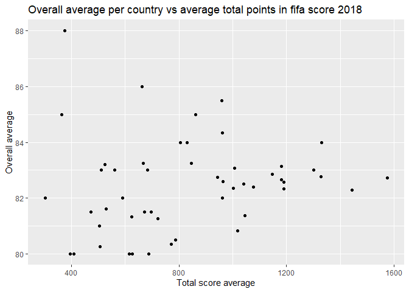<!-- -->

```r
lm_table$avg_total <- log(lm_table$avg_total)
lm_table <- na.omit(lm_table)
lm_table <- lm_table %>% filter(avg_total>=0)
model_finish <- lm(avg_total ~.-Nationality -Overall_avg,data=lm_table)
summary(model_finish)
```

```
## 
## Call:
## lm(formula = avg_total ~ . - Nationality - Overall_avg, data = lm_table)
## 
## Residuals:
##      Min       1Q   Median       3Q      Max 
## -0.43784 -0.10763 -0.00056  0.14059  0.47063 
## 
## Coefficients:
##                         Estimate Std. Error t value Pr(>|t|)  
## (Intercept)             2.657416   3.766244   0.706   0.4913  
## Acceleration_avg       -0.007077   0.048926  -0.145   0.8869  
## Aggression_avg         -0.014162   0.019910  -0.711   0.4878  
## Agility_avg            -0.032156   0.032933  -0.976   0.3444  
## Balance_avg             0.024129   0.021051   1.146   0.2697  
## Ball.control_avg        0.034946   0.069871   0.500   0.6242  
## Composure_avg           0.015787   0.034389   0.459   0.6528  
## Crossing_avg           -0.012755   0.031716  -0.402   0.6932  
## Curve_avg              -0.038354   0.024897  -1.540   0.1443  
## Dribbling_avg           0.005201   0.053227   0.098   0.9235  
## Finishing_avg          -0.019183   0.029212  -0.657   0.5213  
## Free.kick.accuracy_avg  0.004864   0.021166   0.230   0.8213  
## GK.diving_avg           0.089317   0.054871   1.628   0.1244  
## GK.handling_avg        -0.009778   0.039207  -0.249   0.8064  
## GK.kicking_avg         -0.022164   0.052981  -0.418   0.6816  
## GK.positioning_avg     -0.003439   0.053369  -0.064   0.9495  
## GK.reflexes_avg         0.016734   0.075751   0.221   0.8281  
## Heading.accuracy_avg    0.048654   0.028236   1.723   0.1054  
## Interceptions_avg       0.005000   0.026978   0.185   0.8554  
## Jumping_avg             0.008074   0.027847   0.290   0.7758  
## Long.passing_avg        0.034847   0.033321   1.046   0.3122  
## Long.shots_avg          0.005908   0.020410   0.289   0.7762  
## Marking_avg            -0.036195   0.032388  -1.118   0.2813  
## Penalties_avg           0.014695   0.024578   0.598   0.5588  
## Positioning_avg         0.065760   0.039921   1.647   0.1203  
## Reactions_avg          -0.004998   0.035396  -0.141   0.8896  
## Short.passing_avg      -0.023045   0.046957  -0.491   0.6307  
## Shot.power_avg          0.075203   0.036439   2.064   0.0568 .
## Sliding.tackle_avg      0.034357   0.026990   1.273   0.2224  
## Sprint.speed_avg       -0.018900   0.038113  -0.496   0.6272  
## Stamina_avg            -0.031255   0.040650  -0.769   0.4539  
## Standing.tackle_avg     0.010959   0.029255   0.375   0.7132  
## Strength_avg           -0.057620   0.023326  -2.470   0.0260 *
## Vision_avg              0.009296   0.041441   0.224   0.8255  
## Volleys_avg            -0.057670   0.027853  -2.070   0.0561 .
## ---
## Signif. codes:  0 '***' 0.001 '**' 0.01 '*' 0.05 '.' 0.1 ' ' 1
## 
## Residual standard error: 0.3392 on 15 degrees of freedom
## Multiple R-squared:  0.7763,	Adjusted R-squared:  0.2691 
## F-statistic: 1.531 on 34 and 15 DF,  p-value: 0.1907
```
 <br>
 This time, we have tried to fit a linear model in order to predict <br>
 the average fifa's score in all of 2018 measurements by the average of <br>
 the 36 skills that appear in the table fifa_players_attributes of all the<br>   players with overall ability of 80 or more  . <br>

 As , we can see in the plot of average total fifa score of a state vs overall   average of players in that state<br>
 there is some kind of exponential relation between the two. <br>
 therefore, we will use the log of average total fifa score.<br>
 
 The model that managed to predict 77% of the log of average total fifa<br> score of a state variance.
 
 therefore there is some relations between fifa's score and the average  attributes<br>
 of the players in the country.<br>
 
 due to, the fact that football has many unexpected variables that do not<br>
 depend on the players skills (such as injuries,bad calls of referees,managers   and  so on).<br>
 fitting a model with R squared of 77% is not a the worst model<br>
  but on the other hand adj R squared is low and most of the variables are        not<br> significant .<br>
 therefore, we think that in some cases the fifa data set can predict<br>
 fifa's rank. but it's important to choose and analyze each variable impact on<br>fifa's rank.<br>
 

 

