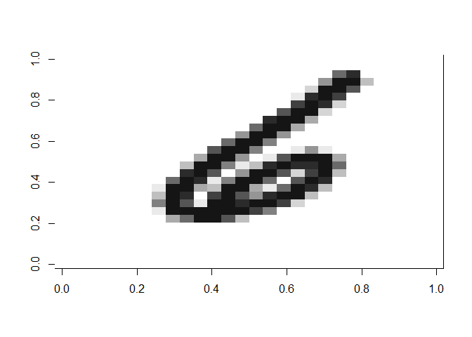
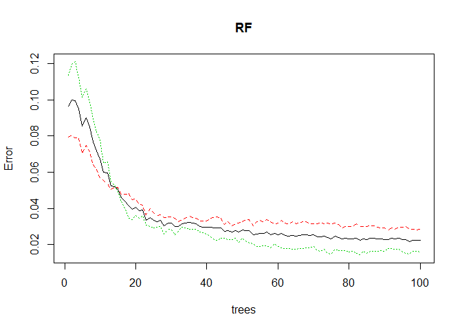
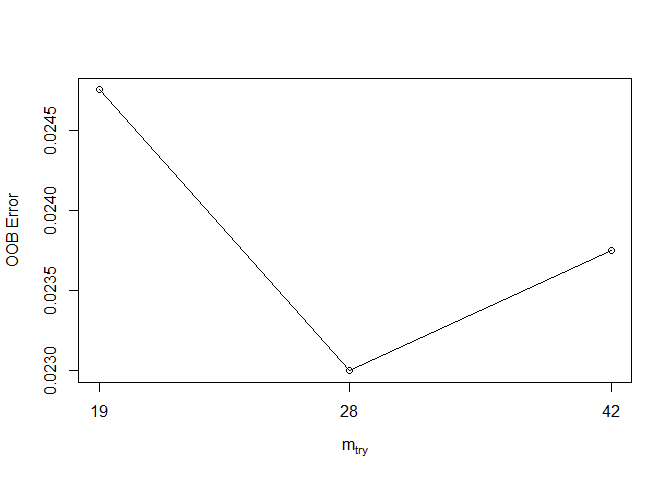
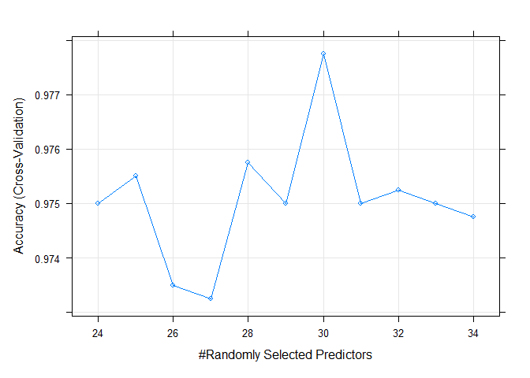
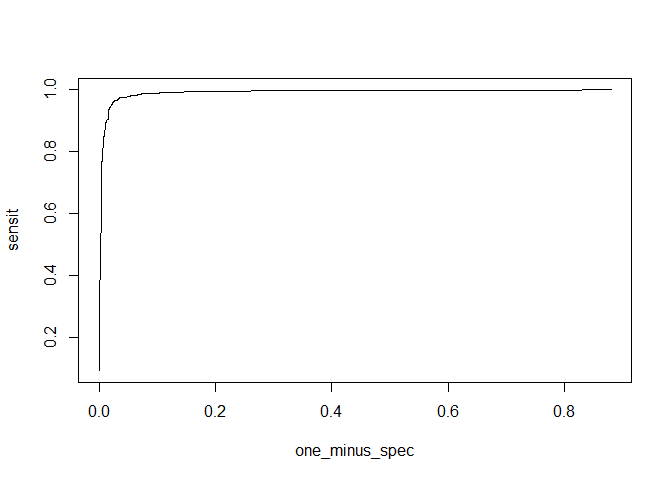
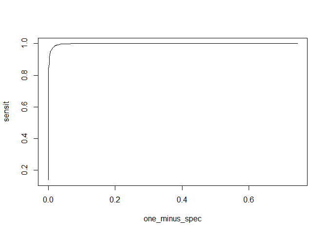

```r
library(glmnet)
library(tidyverse)
library(dplyr)
library(caret)
library(rpart)
library(MASS)
library(randomForest)
library(rattle)
```


```r
# modification of https://gist.github.com/brendano/39760
# automatically obtains data from the web
# creates two data frames, test and train
# labels are stored in the y variables of each data frame
# can easily train many models using formula `y ~ .` syntax

# download data from http://yann.lecun.com/exdb/mnist/
#download.file("http://yann.lecun.com/exdb/mnist/train-images-idx3-ubyte.gz",
#              "train-images-idx3-ubyte.gz")
#download.file("http://yann.lecun.com/exdb/mnist/train-labels-idx1-ubyte.gz",
#              "train-labels-idx1-ubyte.gz")
#download.file("http://yann.lecun.com/exdb/mnist/t10k-images-idx3-ubyte.gz",
#              "t10k-images-idx3-ubyte.gz")
#download.file("http://yann.lecun.com/exdb/mnist/t10k-labels-idx1-ubyte.gz",
#              "t10k-labels-idx1-ubyte.gz")

# gunzip the files
#R.utils::gunzip("train-images-idx3-ubyte.gz")
#R.utils::gunzip("train-labels-idx1-ubyte.gz")
#R.utils::gunzip("t10k-images-idx3-ubyte.gz")
#R.utils::gunzip("t10k-labels-idx1-ubyte.gz")

# helper function for visualization
show_digit = function(arr784, col = gray(12:1 / 12), ...) {
  image(matrix(as.matrix(arr784[-785]), nrow = 28)[, 28:1], col = col, ...)
}

# load image files
load_image_file = function(filename) {
  ret = list()
  f = file(filename, 'rb')
  readBin(f, 'integer', n = 1, size = 4, endian = 'big')
  n    = readBin(f, 'integer', n = 1, size = 4, endian = 'big')
  nrow = readBin(f, 'integer', n = 1, size = 4, endian = 'big')
  ncol = readBin(f, 'integer', n = 1, size = 4, endian = 'big')
  x = readBin(f, 'integer', n = n * nrow * ncol, size = 1, signed = FALSE)
  close(f)
  data.frame(matrix(x, ncol = nrow * ncol, byrow = TRUE))
}

# load label files
load_label_file = function(filename) {
  f = file(filename, 'rb')
  readBin(f, 'integer', n = 1, size = 4, endian = 'big')
  n = readBin(f, 'integer', n = 1, size = 4, endian = 'big')
  y = readBin(f, 'integer', n = n, size = 1, signed = FALSE)
  close(f)
  y
}

# load images
train = load_image_file("train-images-idx3-ubyte")
test  = load_image_file("t10k-images-idx3-ubyte")

# load labels
train$y = as.factor(load_label_file("train-labels-idx1-ubyte"))
test$y  = as.factor(load_label_file("t10k-labels-idx1-ubyte"))

# view test image
show_digit(train[1000, ])
```

<!-- -->


```r
train_only83 <- train[which(train$y %in% c(3,8)),]
test_only83 <- test[which(test$y %in% c(3,8)),]
set.seed(4000)
base_model <- sample(1:dim(train_only83)[1],size = 4000,replace = F)
base_model <- train_only83[base_model,]
```


1. I’d like you to compare two methods, each from a different classifier family (e.g. Classification trees,
Bayesian classifiers, linear discriminants, etc). You can use as features the raw pixel values (0 for white
to 255 for black). 1 Explain your decisions in specifying the penalty and any hyper-parameters, and in choosing the threshold.


```r
# logistic regression
classic <- ifelse(base_model$y==8,1,0)
logit_class_cv <-  cv.glmnet(x=as.matrix(base_model[,1:length(base_model)-1]),y=as.matrix(as.factor(classic)),family = "binomial",alpha = 0)

logit_class <- glmnet(x=base_model[,1:length(base_model)-1],y=as.factor(classic),family = "binomial",alpha = 0,lambda = logit_class_cv$lambda.min)
probs <- logit_class %>% predict(newx = as.matrix(base_model[,1:length(base_model)-1]),type="response")
```

<br> Answer <br>
For this section of the paper we chose the Logistic regression model and the random forest model as our classification models.

<br> Logistic regression <br>
Because the number of variables in our dataset is high(p=784) and many featurs don't contain lots of information we decided to use Ridge regression on our logistic regression in order n shrink unwanted regression coefficients by imposing a penalty on their size.
The penalty $\lambda$ was chosen by preforming 10 fold cross validation.
The threshold that was choosen for this classifier is:
$$\hat{Y} = 1\space\space if\space\space p>=0.5$$
$$\hat{Y} = 0\space\space if\space\space p<0.5$$
We chose this threshold to minimize misclassications.

<br> Random Forest <br>
In this method we had to decided how many trees and how many randomly selected predictors to let our model use.<br>
First we whated to know how many trees to use so we fitted a random forest 
for using 100 trees and 28 randomly selected predictors (which is $\sqrt{p}$ predictors). 

```r
# Random Forest
set.seed(40)
RF<-randomForest(x=base_model[,1:784],y=factor(base_model[,785]),ntree=100)
plot(RF) # first fit a model and use 100 trees as a base line
```

<!-- -->
From this plot we can see that the Error rates stabilize at about 75 trees.<br>
so for our model we chose to use 75 trees.<br>
Next, we whated to see  how many randomly selected predictors to let our model use.<br> So, we tuned this parameter to our preliminary model

```r
set.seed(40)
tuneRF(x=base_model[,1:784],y=factor(base_model[,785]), stepFactor = 1.5, improve = 1e-5, ntree = 75)
```

```
## mtry = 28  OOB error = 2.3% 
## Searching left ...
## mtry = 19 	OOB error = 2.48% 
## -0.07608696 1e-05 
## Searching right ...
## mtry = 42 	OOB error = 2.38% 
## -0.0326087 1e-05
```

<!-- -->

```
##        mtry OOBError
## 19.OOB   19  0.02475
## 28.OOB   28  0.02300
## 42.OOB   42  0.02375
```
It seems that $\sqrt{p}$  predictors is optimal for this model.
Finaly, we used k=3 cross validation to insure our chose of prameter.<br>
To do so, we cross validated over a range predictors around 28 to check if we are in the area of local optimun.


```r
set.seed(40)
control <- trainControl(method='cv',number=3,search='grid')
tunegrid <- expand.grid(.mtry=c(24:34))
RF_tune <- train(x=base_model[,1:784],y=as.factor(classic), 
tuneGrid=tunegrid,method='rf',trControl=control,ntree=75, metric='Accuracy')

print(RF_tune)
```

```
## Random Forest 
## 
## 4000 samples
##  784 predictor
##    2 classes: '0', '1' 
## 
## No pre-processing
## Resampling: Cross-Validated (3 fold) 
## Summary of sample sizes: 2667, 2666, 2667 
## Resampling results across tuning parameters:
## 
##   mtry  Accuracy   Kappa    
##   24    0.9749981  0.9499976
##   25    0.9754989  0.9509987
##   26    0.9734977  0.9469953
##   27    0.9732482  0.9464993
##   28    0.9757477  0.9514981
##   29    0.9749984  0.9499966
##   30    0.9777482  0.9554968
##   31    0.9749984  0.9499996
##   32    0.9752481  0.9504952
##   33    0.9749981  0.9499989
##   34    0.9747478  0.9494992
## 
## Accuracy was used to select the optimal model using the largest value.
## The final value used for the model was mtry = 30.
```

```r
plot(RF_tune)
```

<!-- -->
The result show that all the selection of predictor number are over 97% accuracy so the chose of 28 predictors was right (the model chose 30 predictors because it had the highest accuracy)


2. Write your own function that calculates (a) the confusion matrix (b) the precision and (c) the recall
(assume the class 3 is positive). Calculate the values for both classifiers. Do you observe overfitting of
the classifier?

<br> Answer <br>
In this section we build a function that calculates. <br>
(a) the confusion matrix <br>
(b) the precision and <br>
(c) the recall <br>

And then, we calculated those measures on our train and test sets in order to get a broad perspective on our models.

<br> measures on train <br>


```r
prob_log <- ifelse(probs>=0.5, 8, 3)
log_compare <- as.data.frame(cbind(as.numeric(prob_log),as.numeric(as.vector(base_model$y))))
colnames(log_compare) <- c("Y_hat", "Y")
table(log_compare$Y_hat, log_compare$Y)
```

```
##    
##        3    8
##   3 1976   46
##   8   58 1920
```

```r
prob_rf <- predict(RF_tune,base_model[,1:784],type = "prob")
class_RF <- ifelse(as.numeric(prob_rf[,2])>=0.5,8,3)
run_forest <- as.data.frame(cbind(class_RF,as.numeric(as.vector(base_model$y))))
colnames(run_forest) <- c("Y_hat", "Y")
values <- function(Y,Y_hat){
  P <- sum(Y == 3)
  P_star <- sum(Y_hat==3)
  TP <- sum(ifelse(Y_hat==Y & Y==3,1,0))
  my_recall <- TP/P
  my_precision <- TP/P_star
  my_confusion <- matrix(nrow = 3,ncol = 3)
  my_confusion[1,1] <-sum(ifelse(Y_hat==Y & Y_hat==3,1,0))
  my_confusion[1,2] <-sum(ifelse(Y_hat!=Y & Y_hat==3,1,0))
  my_confusion[2,1] <-sum(ifelse(Y_hat!=Y & Y_hat==8,1,0)) 
  my_confusion[2,2] <-sum(ifelse(Y_hat==Y & Y_hat==8,1,0))
  my_confusion[1,3] <- sum(Y_hat == 3)
  my_confusion[2,3] <- sum(Y_hat == 8)
  my_confusion[3,1] <- sum(Y == 3)
  my_confusion[3,2] <- sum(Y == 8)
  my_confusion <- t(my_confusion)
  my_confusion <- data.frame(my_confusion,row.names = c("True 3","True 8","Total predict"))
  colnames(my_confusion)<- c("Predict 3","Predict 8","Total Ture")
  return(list(my_recall,my_precision,my_confusion))
}
# values for train data
values(log_compare$Y,log_compare$Y_hat)
```

```
## [[1]]
## [1] 0.9714848
## 
## [[2]]
## [1] 0.9772502
## 
## [[3]]
##               Predict 3 Predict 8 Total Ture
## True 3             1976        58       2034
## True 8               46      1920       1966
## Total predict      2022      1978         NA
```

```r
values(run_forest$Y,run_forest$Y_hat)
```

```
## [[1]]
## [1] 1
## 
## [[2]]
## [1] 1
## 
## [[3]]
##               Predict 3 Predict 8 Total Ture
## True 3             2034         0       2034
## True 8                0      1966       1966
## Total predict      2034      1966         NA
```
On our Logistic regression model

the recall and the precision are very high when examning the model on it's trainng set.<br>


```r
probs2 <- logit_class %>% predict(newx = as.matrix(test_only83[,1:length(test_only83)-1]),type="response")
prob_log2 <- ifelse(probs2>=0.5, 8, 3)
log_compare2 <- as.data.frame(cbind(as.numeric(prob_log2),as.numeric(as.vector(test_only83$y))))
colnames(log_compare2) <- c("Y_hat", "Y")
RF_pred2 <- predict(RF_tune,test_only83[,1:length(test_only83)-1],type = "prob")
class_RF2 <- ifelse(as.numeric(RF_pred2[,2])>=0.5,8,3)
run_forest2 <- as.data.frame(cbind(class_RF2,as.numeric(as.vector(test_only83$y))))

colnames(run_forest2) <- c("Y_hat", "Y")
# values for train data
values(log_compare2$Y,log_compare2$Y_hat)
```

```
## [[1]]
## [1] 0.9683168
## 
## [[2]]
## [1] 0.9702381
## 
## [[3]]
##               Predict 3 Predict 8 Total Ture
## True 3              978        32       1010
## True 8               30       944        974
## Total predict      1008       976         NA
```

```r
values(run_forest2$Y,run_forest2$Y_hat)
```

```
## [[1]]
## [1] 0.9792079
## 
## [[2]]
## [1] 0.988012
## 
## [[3]]
##               Predict 3 Predict 8 Total Ture
## True 3              989        21       1010
## True 8               12       962        974
## Total predict      1001       983         NA
```


```r
my_ROC <-function(s,Y,prob) {
  prob <- round(prob,3)
  sensit <- rep(0,length(s))
  one_minus_spec <- rep(0,length(s))
  for (i in 1:length(s)) {
    Y_hat <- ifelse(prob>=s[i],8,3)
    TP <- sum(ifelse(Y_hat==Y & Y_hat==8,1,0))/sum(ifelse(Y==8,1,0))
    FP <- sum(ifelse(Y_hat!=Y & Y_hat==8,1,0))/sum(ifelse(Y==3,1,0))
    sensit[i]<-TP
    one_minus_spec[i]<-FP
  }
  plot(one_minus_spec,sensit,type = "l")
}
s<-seq(0.001,1,0.001)
my_ROC(s,log_compare2$Y,probs2)
```

<!-- -->

```r
my_ROC(s,run_forest2$Y,RF_pred2[,2])
```

<!-- -->


```r
### to good to be true?
more_train <- sample(1:dim(train_only83)[1],size = 1000,replace = F)
more_train <- train_only83[more_train,]
prob_rf <- predict(RF_tune,more_train[,1:784],type = "prob")
class_RF <- ifelse(as.numeric(prob_rf[,2])>=0.5,8,3)
run_forest <- as.data.frame(cbind(class_RF,as.numeric(as.vector(more_train$y))))
colnames(run_forest) <- c("Y_hat", "Y")
values(run_forest$Y,run_forest$Y_hat)
```

```
## [[1]]
## [1] 0.9920792
## 
## [[2]]
## [1] 0.9881657
## 
## [[3]]
##               Predict 3 Predict 8 Total Ture
## True 3              501         4        505
## True 8                6       489        495
## Total predict       507       493         NA
```


